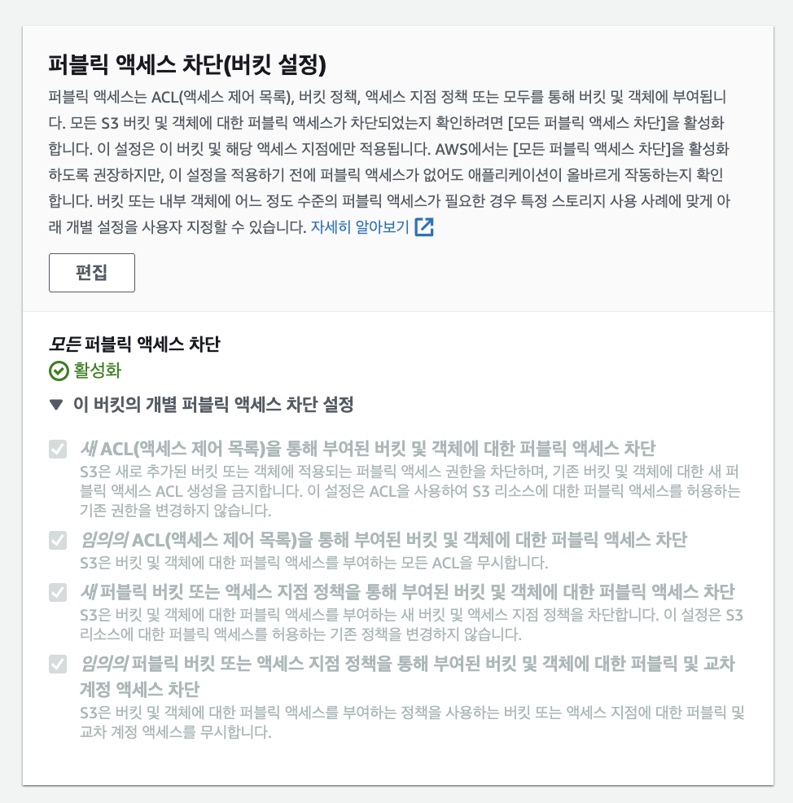
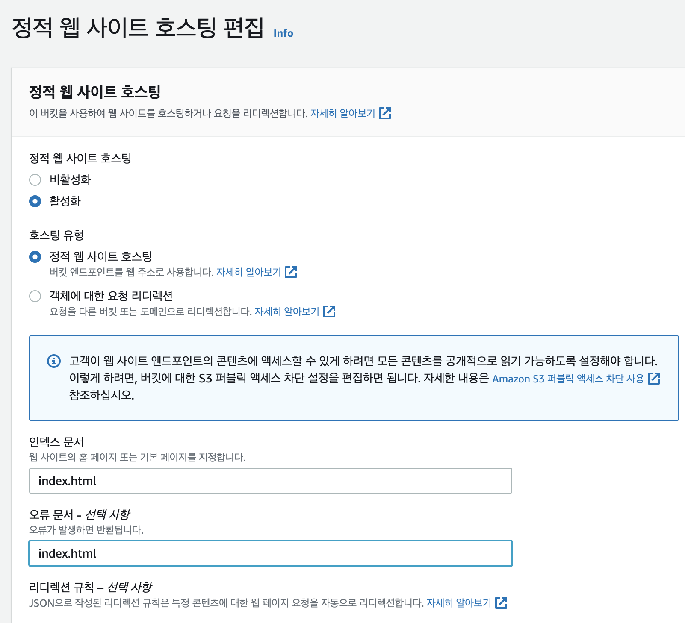
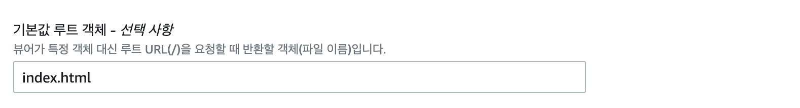
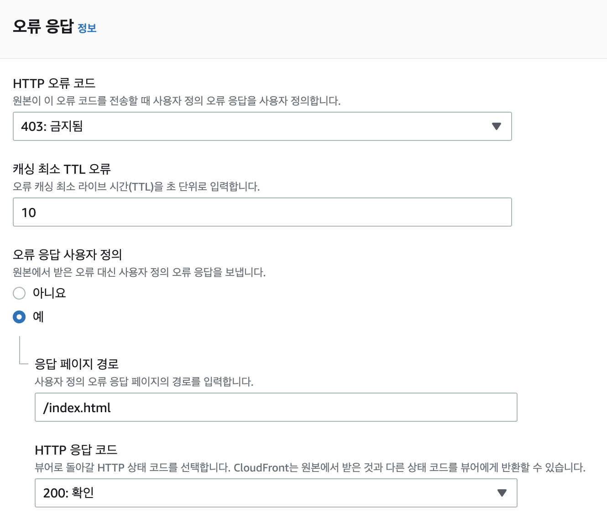
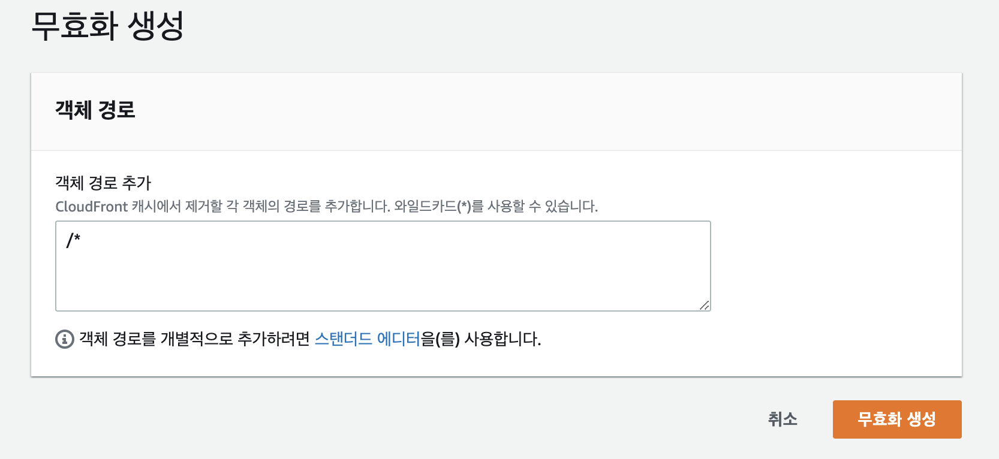
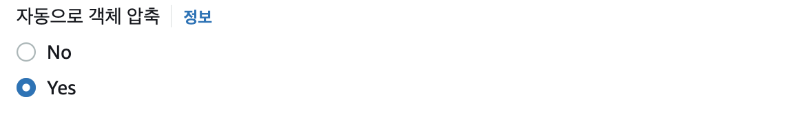

import { MDXImageWrapper, ToggleList } from 'components';

# 들어가며

S3와 CloudFront로 정적 웹 사이트를 배포해야할 필요가 생겼다. 프로젝트를 진행하면서 S3에 대해서 종종 들었지만, 정확히 어떤 특징을 가진 서버인지 알지 못했다. 따라서 이번 기회에 S3와 CloudFront에 대해 정리하려한다.

<br/>

# S3란?

> Amazon Simple Storage Service(Amazon S3)는 업계 최고의 확장성, 데이터 가용성, 보안 및 성능을 제공하는 객체 스토리지 서비스입니다.
> 
> 
> [AWS 사용 설명서](https://docs.aws.amazon.com/ko_kr/AmazonS3/latest/userguide/Welcome.html)에서 S3에 대해 위와 같이 설명한다. 즉, S3(Simple Storage Service)는 이름 그대로 간단한 저장소를 제공하는 서비스이다. 주로 정적 컨텐츠를 저장할 때 사용된다.
> 

<br/>

웹 컨텐츠를 S3에 저장하면 다음과 같은 이점이 있다.

1. S3 버킷이 자동으로 확장 및 축소되기 때문에 스토리지 공간을 계획하여 특정 크기를 할당할 필요가 없습니다.
2. 서버리스(Serverless) 서비스이기 때문에 파일이 저장되는 서버를 관리하거나 패치할 필요가 없습니다.
3. 애플리케이션(동적 애플리케이션 등)에 서버가 필요하더라도 정적 콘텐츠에 대한 요청을 처리할 필요가 없기 때문에 서버 크기를 줄일 수 있습니다.

<br/>

## S3 관련 용어

### 버킷

데이터를 저장하고 있는 컨테이너이다. S3는 객체 단위로 데이터를 저장한다. 따라서 버킷은 객체 들의 컨테이너라고 할 수 있다.

<br/>

### 객체

S3에 저장되는 데이터의 기본 단위

<br/>

### 키

버킷 내의 각 객체를 식별할 수 있는 고유한 값이다.

<br/>

관련 용어에 대한 자세한 설명은 아래 북마크된 문서의 **Amazon S3 작동 방식** 부분에서 확인 가능하다.

[Amazon S3란 무엇인가요?](https://docs.aws.amazon.com/ko_kr/AmazonS3/latest/userguide/Welcome.html)

<br/>

# CloudFront란?

> CloudFront는 전 세계의 정적/동적 웹 콘텐츠, 비디오 스트림 및 API를 안전하게 대규모로 전송할 수 있는 콘텐츠 전송 네트워크(CDN) 서비스입니다. CloudFront에서 데이터를 전송하면 설계상 S3에서 직접 사용자에게 전송하는 것보다 더욱 비용 효율적입니다.
> 

<br/>

[AWS 블로그 문서](https://aws.amazon.com/ko/blogs/korea/amazon-s3-amazon-cloudfront-a-match-made-in-the-cloud/)에는 위와 같이 CloudFront가 정의돼 있다. 즉, CloudFront는 CDN 서비스이다.

<br/>

CloudFront는 엣지 로케이션 덕분에 전 세계 네트워크를 통해 컨텐츠를 빠르게 제공할 수 있다. CloudFront의 특징을 정리하면 다음과 같다.

<br/>

1. CloudFront는 컨텐츠를 캐싱하고 있다.
    - 사용자가 요청한 컨텐트를 CloudFront에서 캐싱하고 있다면 바로 제공한다.
    - 그렇지 않다면 S3와 같이 컨텐츠를 저장하고 있는 서버에서 컨텐츠를 가져온 후 제공 및 저장 과정을 거친다. CloudFront는 TCP Handsake에 최적화되어 있기 때문에 S3와 빠르게 통신이 가능하다. 이와 관련해서 AWS 블로그에 아래와 같이 명시돼 있다.
        
        > 콘텐츠가 엣지 서버에 아직 캐싱되어 있지 않으면 CloudFront가 S3 버킷 오리진에서 해당 콘텐츠를 가져옵니다. 그 밖에도 콘텐츠가 퍼블릭 인터넷이 아닌 AWS 프라이빗 네트워크를 통해 전송되는 동시에 CloudFront가 TCP 핸드셰이크를 최적화하기 때문에 요청 및 콘텐츠 반환 속도가 퍼블릭 인터넷을 통해 액세스하는 것보다 훨씬 빠릅니다.
        > 
        
2. CloudFront는 전 세계 여러 곳에 엣지 서버가 존재합니다.
    - 사용자가 CloudFront에서 제공하는 컨텐츠를 요청했을 때, 가까운 엣지 로케이션으로 라우팅됩니다.
    - 덕분에 사용자는 물리적으로 가까운 위치의 서버로부터 컨텐츠를 제공 받는다.

<br/>

# S3와 CloudFront를 이용해서 정적 사이트 배포하기

## S3 배포

### S3 버킷 생성하기

아래 사진 처럼 모든 퍼블릭 액세스를 차단한 후 버킷을 생성한다.

<MDXImageWrapper caption="S3 버킷 생성하기 - 모든 퍼블릭 액세스 차단">
  
</MDXImageWrapper>

<br/>

### 버킷 정책 편집하기

생성한 버킷의 상세 페이지 > 권한 탭으로 이동하면 ****버킷 정책**** 섹션을 볼 수 있다.

<br/>

버킷 정책은 기본적으로 아래 예시처럼 설정할 수 있다.

❗️Resource 속성의 값을 방금 생성한 버킷 이름으로 수정해야한다.

```jsx
{
    "Version": "2012-10-17",
    "Statement": [
        {
            "Sid": "PublicReadGetObject",
            "Effect": "Allow",
            "Principal": "*",
            "Action": "s3:GetObject",
            "Resource": "arn:aws:s3:::{BucketName}/*"
        }
    ]
}
```

<br/>

<ToggleList summary="버킷 정책에 대한 설정 속성">
    - Version : “2012–10–17”, “2008–10–17” 값을 가질 수 있습니다.
    - ID : (optional) Policy 의 구분자로 UUID를 사용하기를 권장합니다. 예) cd3ad3d9–2776–4ef1-a904–4c229d1642ee”
    - SID : (optional) Statement ID로 statement 를 구분하기 위해서 사용
    - Effect : Allow, Deny 사용
    - Principal , NotPrincipal : 대상(주체)를 지정합니다. 예를 들면 Users, Services, Federated users, Roles 가 될 수 있습니다.
    - Action, NotAction : 서비스의 API Calls를 지정합니다.
    - Resource, NotResource : Action이 영향을 미치는 리소스 리스트를 지정합니다.
    - Condition : 조건을 넣어 줄 수 있습니다. 조건을 충족되는 경우에만 해당 정책을 적용시킬 수 있습니다.
</ToggleList>

<br/>

### 정적 웹 사이트 호스팅하기

웹 사이트를 호스팅하기 위해서는 버킷에 접근할 수 있는 도메인이 필요하다. 정적 웹 사이트 호스팅에 대한 설정은 **속성 > 정적 웹사이트 호스팅**에서 할 수 있다.

<br/>

정적 웹 사이트 호스팅 편집에서 아래와 같은 설정을 했다.

1. 정적 웹사이트 호스팅 옵션을 활성화
2. 인덱스 문서: index.html
3. 오류 문서: index.html

<MDXImageWrapper caption="정적 웹 사이트 호스팅 편집 예시">
  
</MDXImageWrapper>

<br/>

## CloudFront 배포

### CloudFront 배포 생성

CloudFront 배포 생성을 할 때 설정한 옵션은 아래와 같다.

- 원본 도메인
    - 방금 생성한 S3 버킷을 지정한다.
- S3 버킷 엑세스
    - 새 OAI를 생성한다.
    - CloudFront에서 S3로 접근이 가능하도록 허용하기 위해 버킷 정책 옵션도 `예, 버킷 정책 업데이트`로 설정한다.
- 뷰어 프로토콜 정책
    - HTTP로 들어온 요청을 자동으로 HTTPS로 변경하기 위해서 `Redirect HTTP to HTTPS`로 설정한다.

<br/>

### 기본값 루트 객체 설정

CloudFront에 루트 url로 접근했을 때 반환되는 객체에 대한 설정이다. **일반 > 설정 > 편집 > 기본값 루트 객체**에서 값을 설정할 수 있다.

index.html이 반환되는 것을 의도했기 때문에 index.html을 명시했다.

<MDXImageWrapper caption="기본값 루트 객체 설정 예시">
  
</MDXImageWrapper>

<br/>

### 사용자 정의 오류 응답 생성

오류에 대해 사용자 정의 응답을 반환할 수 있다. 이를 통해 웹 정적 페이지를 호스팅할 때, root path가 아닌 다른 path에서 새로 고침해도 오류 페이지 대신 페이지를 지속적으로 제공할 수 있다. 사용자 정의 오류 응답은 **오류 페이지 > 사용자 정의 오류 응답 생성**에서 할 수 있다. 

root path가 아닌 다른 path에서 새로 고침을 하면 403에러가 발생한다. 이에 대한 에러를 처리하기 위해서 403 에러가 발생했을 때 index.html을 반환하도록 설정했다.

<MDXImageWrapper caption="사용자 정의 오류 응답 예시">
  
</MDXImageWrapper>

<br/>

### 캐시 무효화 설정 및 객체 압축

S3에 업데이트된 최신 컨텐츠를 제공하기 위해서 CloudFront에 저장된 캐시 파일을 제거할 필요가 있다. 이런 경우 무효화를 진행시키면 된다. **무효화 > 무효화 생성** 진행할 수 있다.

다음과 같이 객체 경로에 `/*` 입력하면 모든 객체에 대한 캐시를 제거할 수 있다.

<MDXImageWrapper caption="캐시 무효화 설정 예시">
  
</MDXImageWrapper>

<br/>

## 객체 압축

**동작 편집 > 동작 > 편집**에서 객체 압축 여부를 설정할 수 있다.

객체를 압축하면 클라이언트로 제공하는 객체의 크기가 압축된 상태로 제공된다.

<MDXImageWrapper caption="객체 압축 예시">
  
</MDXImageWrapper>

<br/>

# 끝으로

S3와 CloudFront에 대해서 공부하면서, 정적 페이지를 배포하는 새로운 방법에 대해 알게됐다. 또한 S3와 EC2의 차이에 대한 의문점에서 출발해 Web Server와 Web Application Server에 대한 차이점도 간략히 공부할 수 있었다.

<br/>

# 참고 자료

[Amazon S3란 무엇인가요?](https://docs.aws.amazon.com/ko_kr/AmazonS3/latest/userguide/Welcome.html)

[실전 Amazon S3와 CloudFront로 정적 파일 배포하기 | Amazon Web Services](https://aws.amazon.com/ko/blogs/korea/amazon-s3-amazon-cloudfront-a-match-made-in-the-cloud/)

[사례별로 알아본 안전한 S3 사용 가이드 | 우아한형제들 기술블로그](https://techblog.woowahan.com/6217/)