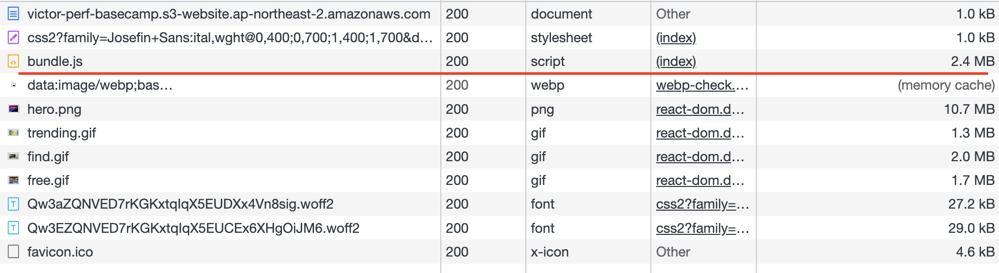
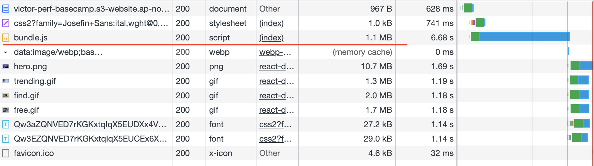
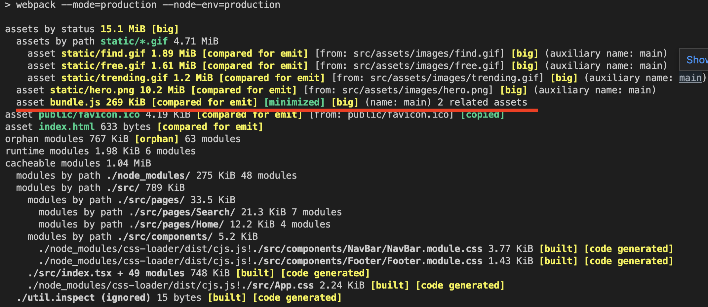
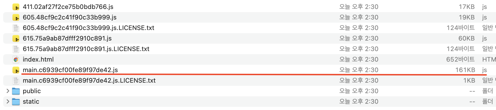
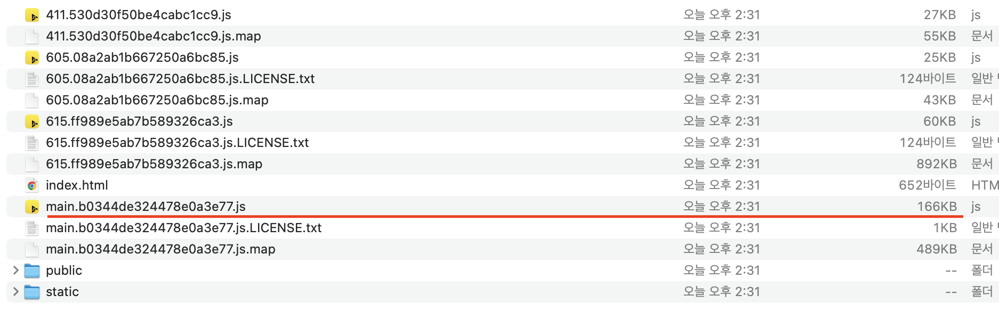

import { MDXImageWrapper, ToggleList } from 'components';

# 들어가며

최적화를 진행하기 위해 요청한 리소스의 크기를 줄이는 방법이 있다. 이번 게시글에서는 webpack으로 프로젝트를 번들링할 때 js 파일의 크기를 줄이는 방법에 대해서 정리하려한다.

<br/>

<br/>

<ToggleList summary="webpack 최적화를 시키기 전 webpack.config.js">
  ```jsx
    const path = require('path');
    const HtmlWebpackPlugin = require('html-webpack-plugin');
    const Dotenv = require('dotenv-webpack');
    const CopyWebpackPlugin = require('copy-webpack-plugin');
    
    module.exports = {
      entry: './src/index.tsx',
      resolve: { extensions: ['.ts', '.tsx', '.js', '.jsx'] },
      output: {
        filename: 'bundle.js',
        path: path.join(__dirname, '/dist'),
        clean: true
      },
      devServer: {
        hot: true,
        open: true,
        historyApiFallback: true
      },
      devtool: 'source-map',
      plugins: [
        new HtmlWebpackPlugin({
          template: './index.html'
        }),
        new CopyWebpackPlugin({
          patterns: [{ from: './public', to: './public' }]
        }),
        new Dotenv()
      ],
      module: {
        rules: [
          {
            test: /\.(js|jsx|ts|tsx)$/i,
            exclude: /node_modules/,
            use: {
              loader: 'ts-loader'
            }
          },
          {
            test: /\.css$/i,
            use: ['style-loader', 'css-loader']
          },
          {
            test: /\.(eot|svg|ttf|woff|woff2|png|jpg|gif)$/i,
            loader: 'file-loader',
            options: {
              name: 'static/[name].[ext]'
            }
          }
        ]
      },
      optimization: {
        minimize: false
      }
    };
  ```
</ToggleList>

<br/>

# mode 옵션

webpack을 실행할 때 mode에 따라 bundle size의 크기가 달라진다.

<br/>

아래의 두 사진은 왼쪽부터 각각 development 모드로 build한 bundle의 크기와 production 모드로 build한 bundle 크기이다.

<MDXImageWrapper caption="개발 모드로 빌드 했을 때">
  
</MDXImageWrapper>

<MDXImageWrapper caption="프로덕션 모드로 빌드 했을 때">
  
</MDXImageWrapper>

<br/>

webpack으로 build할 때 production mode를 사용해서 2.4MB → 1.1MB로 번들 사이즈가 줄어드는 효과를 확인했다. 이를 통해 webpack mode를 production으로 설정하는 것만으로 최적화 효과가 있는 것과 배포를 할때 production 모드를 사용해야하는 이유에 대해서 알게됐다.

<br/>

## production 모드로 실행시키면 무엇이 달라질까?

webpack 공식문서의 production 모드에 대한 설명은 다음과 같다.

<br/>

> `DefinePlugin`의 `process.env.NODE_ENV`를 `production`으로 설정합니다. 모듈과 청크, `FlagDependencyUsagePlugin`, `FlagIncludedChunksPlugin`, `ModuleConcatenationPlugin`, `NoEmitOnErrorsPlugin`, `TerserPlugin` 등에 대해 결정적 망글이름(mangled name)을 사용할 수 있습니다.
> 

<br/>

mangled name이 정확히 어떤 개념인지 모르겠지만(추후에 조사 필요!!) 목록에 명시된 플러그인을 적용한다고 추측이된다.

<br/>

실제로 [김정환님의 웹팩(심화) 게시글](https://jeonghwan-kim.github.io/series/2020/01/02/frontend-dev-env-webpack-intermediate.html#4-%EC%B5%9C%EC%A0%81%ED%99%94)에서 production 모드로 빌드를 할 때 아래의 플러그인들이 사용된다고 명시돼 있다.

<br/>

- FlagDependencyUsagePlugin
- FlagIncludedChunksPlugin
- ModuleConcatenationPlugin
- NoEmitOnErrorsPlugin
- OccurrenceOrderPlugin
- SideEffectsFlagPlugin
- TerserPlugin

<br/>

플러그인 목록을 확인한 후 `만약, 해당 플러그인들이 설치되지 않았다면 최적화가 진행되지 않는 것인가?` 라는 의문이 생겼다. 

<br/>

> Webpack v5 comes with the latest `terser-webpack-plugin` out of the box.
> 

<br/>

하지만 위 플러그인 중 하나인 [TerserPlugin의 공식문서](https://webpack.js.org/plugins/terser-webpack-plugin/#getting-started)를 보면 위와 같이 `webpack5 부터는 기본적으로 해당 플러그인이 같이 제공된다.` 고 명시돼 있다. 이를 통해 다른 플러그인들도 webpack5에 기본적인 플러그인 기능이 같이 제공될 것으로 추측된다. 따라서 해당 플러그인들이 명시적으로 설치되지 않아도 production 모드에서 해당 플러그인 들을 사용하여 최적화가 진행될 것으로 예상된다.

<br/>

💡TerserPlugin의 경우 추가적인 옵션을 사용하기 위해서는 플러그인을 명시적으로 설치해야한다.

💡TerserPlugin은 [terser](https://github.com/terser/terser)를 이용해서 javascript 파일을 minify/minimize 한다.

<br/>

# optimization 옵션

[optimization](https://webpack.js.org/configuration/optimization/)은 webpack에서 최적화를 설정하기 위한 옵션이다.

<br/>

## optimization.minimize

optimization.minimize 속성에 true 값을 주면 webpack은 [TerserPlugin](https://webpack.js.org/plugins/terser-webpack-plugin/) 또는 opmization.minimizer에 명시된 플러그인들로 최적화를 실행한다. 기본 값은 true이기 때문에 해당 속성을 따로 명시하지 않아도 최적화가 진행된다.

<br/>

<MDXImageWrapper caption="optimization.minimize 적용 후 bundle 크기">
  
</MDXImageWrapper>

위 사진에 나왔듯이 minimize를 적용하는 것 만으로 minimize가 false일 때보다 bundle 크기가 1.1MB에서 269KB로 감소했다.

<br/>

실제로 bundle.js의 코드 라인 수를 비교하면 아래와 같다.

- minimize가 false 일 때
    - 라인 수: 10813줄
    - 대략적인 파일 모습
        
        ```jsx
        /******/ (() => { // webpackBootstrap
        /******/ 	var __webpack_modules__ = ({
        
        /***/ 8617:
        /***/ (function(__unused_webpack_module, exports, __webpack_require__) {
        
        "use strict";
        
        var __assign = (this && this.__assign) || function () {
            __assign = Object.assign || function(t) {
                for (var s, i = 1, n = arguments.length; i < n; i++) {
                    s = arguments[i];
                    for (var p in s) if (Object.prototype.hasOwnProperty.call(s, p))
                        t[p] = s[p];
                }
                return t;
            };
            return __assign.apply(this, arguments);
        };
        var __importDefault = (this && this.__importDefault) || function (mod) {
            return (mod && mod.__esModule) ? mod : { "default": mod };
        };
        Object.defineProperty(exports, "__esModule", ({ value: true }));
        exports.GiphyFetch = void 0;
        /* eslint-disable no-dupe-class-members */
        var js_util_1 = __webpack_require__(3859);
        var qs_1 = __importDefault(__webpack_require__(2431));
        var gif_1 = __webpack_require__(1073);
        var request_1 = __importDefault(__webpack_require__(9669));
        var getType = function (options) { return (options && options.type ? options.type : 'gifs'); };
        ```
        

<br/>

- minimize가 true일 때
    - 라인 수: 3줄(하지만, column 수가 274976까지 증가했다.)
    - 대략적인 파일 모습
        
        ```jsx
        /*! For license information please see bundle.js.LICENSE.txt */
        (()=>{var e={8617:function(e,t,n){"use strict";var r=this&&this.__assign||function(){return...
        //# sourceMappingURL=bundle.js.map
        ```
        

<br/>

[TerserPlugin의 공식 문서](https://github.com/terser/terser#cli-mangling-property-names---mangle-props)를 확인해보면 위와 같은 javascript 파일의 압축은 TerserPlugin이 수행하는 것으로 보인다. 따라서 optimization.minimize를 false로 적용하면 TerserPlugin이 적용되지 않아 javascript 코드의 압축이 진행되지 않는 것으로 추측한다.

## optimization.minimizer

optimization.minimizer에는 최적화를 위해 사용하는 플러그인을 명시하는 속성이다.

<br/>

minimizer 속성으로 최적화할 때 적용되는 plugin을 재정의 할 때, ‘…’을 같이 사용하면 기존에 default로 적용되던 plugin도 같이 적용할 수 있다.

```jsx
optimization: {
    minimizer: ['...', new ExamplePlugin()]
  }
```

# devtool 옵션

[devtool](https://webpack.kr/configuration/devtool/)은 소스맵 생성 여부와 방법을 제어하는 옵션이다. 

## 소스맵(source map)이란?

소스맵(sourcemap)은 minimize되고 uglify가 일어난 파일을 디버깅할 수 있도록 도와주는 역할을 한다.

<br/>

## 소스맵을 production mode로 build할 때 포함시켜야 할까?

답은 ‘**포함시키면 안된다.**’ 이다. 소스맵은 디버깅을 도와주는 역할을 하는데, 소스맵을 같이 제공하면 개발자가 난독화 시킨 코드가 해석될 여지가 있다. 따라서 production을 제공할 때는 소스맵을 포함시키면 안된다.

<br/>

소스맵 생성하면 원본 파일과 빌드한 파일을 연결해주는 역할을 하는데, 이는 빌드된 파일을 크기를 약간 증가시키는 것으로 추측한다. 실제로 소스맵 생성 여부에 따라 빌드 파일에 크기가 달라지는 것을 확인했다.

아래의 사진은 왼쪽부터 소스맵 생성 전 main.js 크기, 소스맵 생성 후 main.js 크기이다. 소스맵을 첨부하면 빌드 파일의 크기가 161KB에서 166KB로 증가했다.

<br/>

<MDXImageWrapper caption="devtool false dist 사진">
  
</MDXImageWrapper>

<MDXImageWrapper caption="devtool source-map dist 사진">
  
</MDXImageWrapper>

<br/>

## 설정 예시

소스맵을 production mode에서만 제거하는 속성은 아래처럼 설정할 수 있다.

```jsx
// webpack.config.js
const isProd = process.env.NODE_ENV === 'production';

module.exports = {
  ...
	devtool: isProd ? false : 'source-map',
	...
};
```

<br/>

# 참고 자료

[Concepts | 웹팩](https://webpack.kr/concepts/)

[Optimization | 웹팩](https://webpack.kr/configuration/optimization/)

[프론트엔드 개발환경의 이해: 웹팩(심화)](https://jeonghwan-kim.github.io/series/2020/01/02/frontend-dev-env-webpack-intermediate.html#4-%EC%B5%9C%EC%A0%81%ED%99%94)