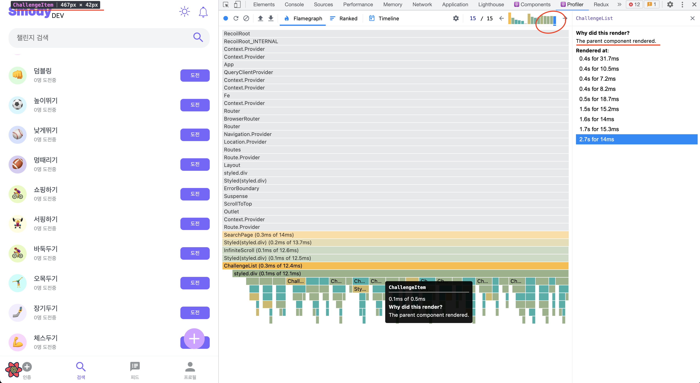
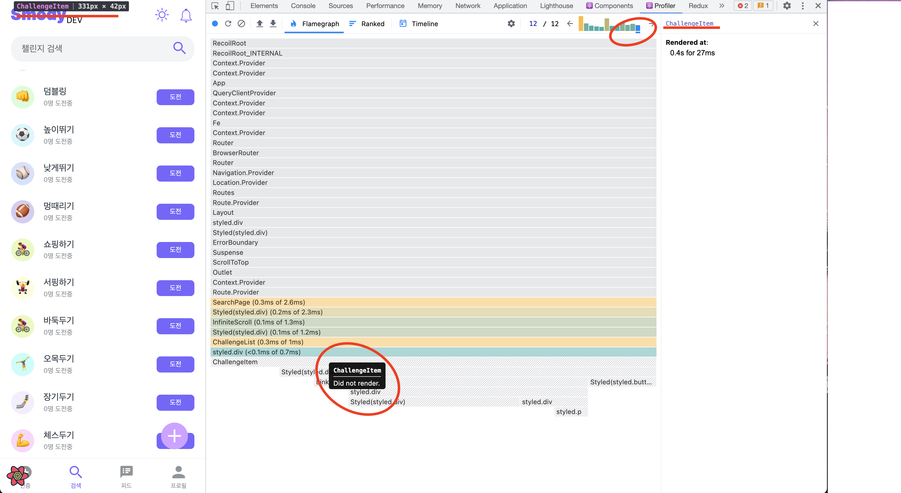

import { MDXImageWrapper } from 'components';

# 성능 측정 환경

1. device: mobile
2. Network throttling speed: Slow 4G throttling
3. CPU throttling: 4x slowdown

 

<MDXImageWrapper style={{ maxWidth: '100%' }} caption="Lighthouse 측정 환경">
  
</MDXImageWrapper>

 

# 성능 측정 지표

[Web Vitals](https://web.dev/vitals/)에서 권장하는 성능 점수를 따르려한다. Web Vitals에 포함된 성능 측정 지표는 다음과 같다.

 

- LCP(**[Largest Contentful Paint, 최대 콘텐츠풀 페인트)](https://web.dev/lcp/)**: *로딩* 성능을 측정합니다. 우수한 사용자 경험을 제공하려면 페이지가 처음으로 로딩된 후 **2.5초** 이내에 LCP가 발생해야 합니다.
- FID(**[First Input Delay, 최초 입력 지연)](https://web.dev/fid/)**: *상호 작용*을 측정합니다. 우수한 사용자 경험을 제공하려면 페이지의 FID가 **100밀리초** 이하여야 합니다.
- CLS(**[Cumulative Layout Shift, 누적 레이아웃 시프트)](https://web.dev/cls/)**: *시각적 안정성*을 측정합니다. 우수한 사용자 경험을 제공하려면 페이지에서 **0.1** 이하의 CLS를 유지해야 합니다.
    - 단, 버튼을 누른 이벤트에 의해 레이아웃이 변경되는 예시처럼 사용자가 화면의 변화를 예측할 수 있는 상황이라면 성능 측정의 대상으로 포함되지 않는다.

 

Lighthouse를 통해 성능을 측정하면 LCP와 CLS를 측정할 수 있다. FID의 경우 Lighthouse로 측정이 불가능하지만, 대신 대체할 수 있는 TBT(Total Blocking Time)을 제공한다. 따라서 해당 지표들은 Lighthouse를 통해 측정하기로 결정했다. TBT의 경우 Lighthouse에서 빠름의 기준이 되는 200ms 이하로 유지하는 것을 목표로 했다.

 

# 성능 개선 적용 현황

서비스 성능을 측정하고 개선한 페이지 목록은 다음과 같다.

- 랜딩 페이지
- 검색 페이지
- 피드 페이지

 

## 랜딩 페이지

### 데스크탑

**📌 개선 전**

<MDXImageWrapper style={{ maxWidth: '100%' }} caption="데스크탑 성능 개선 전 Lighthouse 점수">
  
</MDXImageWrapper>

 

|  | LCP(s) | TBT(ms) | CLS |
| --- | --- | --- | --- |
| 1차 | 1.2 | 10 | 0 |
| 2차 | 1.5 | 10 | 0 |
| 3차 | 1.3 | 10 | 0 |
| 4차 | 1.2 | 10 | 0 |
| 5차 | 1.2 | 10 | 0 |
| 평균 | 1.28 | 10 | 0 |

 

 

**📌 개선 후**

<MDXImageWrapper style={{ maxWidth: '100%' }} caption="데스크탑 성능 개선 후 Lighthouse 점수">
  
</MDXImageWrapper>

 

|  | LCP(s) | TBT(ms) | CLS |
| --- | --- | --- | --- |
| 1차 | 1.4 | 0 | 0 |
| 2차 | 1.2 | 0 | 0 |
| 3차 | 1.0 | 0 | 0 |
| 4차 | 1.1 | 0 | 0 |
| 5차 | 1.1 | 0 | 0 |
| 평균 | 1.16 | 0 | 0 |

 

 

### 모바일

**📌 개선 전**

<MDXImageWrapper style={{ maxWidth: '100%' }} caption="모바일 성능 개선 전 Lighthouse 점수">
  
</MDXImageWrapper>

 

|  | LCP(s) | TBT(ms) | CLS |
| --- | --- | --- | --- |
| 1차 | 7.4 | 200 | 0 |
| 2차 | 7.4 | 170 | 0 |
| 3차 | 7,4 | 190 | 0 |
| 4차 | 7.3 | 200 | 0 |
| 5차 | 7.7 | 179 | 0 |
| 평균 | 7.44 | 187.8 | 0 |

 

 

**📌 개선 후**

<MDXImageWrapper style={{ maxWidth: '100%' }} caption="모바일 성능 개선 후 Lighthouse 점수">
  
</MDXImageWrapper>

 

|  | LCP(s) | TBT(ms) | CLS |
| --- | --- | --- | --- |
| 1차 | 3.5 | 100 | 0 |
| 2차 | 3.9 | 100 | 0 |
| 3차 | 3.3 | 190 | 0 |
| 4차 | 3.9 | 100 | 0 |
| 5차 | 2.8 | 100 | 0 |
| 평균 | 3.48 | 118 | 0 |

 

 

### 개선 사항

📌 **이미지 사이즈 압축**

이미지를 압축하여 용량을 줄였습니다. 또한 이미지 확장자를 webp로 변경했습니다. 추가로 webp를 지원하지 않은 브라우저에 대응했습니다.

 

📌 **리소스를 gzip을 통해 압축**

Ngnix에서 gzip 설정을 통해 리소스를 압축해서 전달했습니다.

 

📌 **페이지를 기준으로 코드 스플리팅 적용**

`React.lazy()` 를 이용해서 페이지를 기준으로 코드 스플리팅을 진행했습니다. 따라서 각 페이지에서 필요한 js 파일만 요청하게 됐습니다.

 

변경 전 두 개였던 js 파일이 20개의 js 파일로 나눠졌습니다.

**변경 전**

<MDXImageWrapper style={{ maxWidth: '100%' }} caption="코드 스플리팅 적용 전">
  
</MDXImageWrapper>

**변경 후**

<MDXImageWrapper style={{ maxWidth: '100%' }} caption="코드 스플리팅 적용 후">
  
</MDXImageWrapper>

 

**📌 HTTP2 적용**

많은 리소스를 빠르게 응답으로 받기 위해 프론트엔드 서버에서 HTTP 2.0을 지원하도록 구현했습니다.

 

### 총평

성능 개선 작업을 향상된 지표는 아래와 같다.

모바일

- LCP: 7.44 → 3.48
- TBT: 187.8 → 118

 

LCP의 경우 모바일 테스트 환경에서 목표했던 **2.5초** 이하를 달성하지 못했지만, Lighthouse 기준으로 POOR 단계에서 NEES IMPROVEMENT 단계로 낮췄습니다. 데스크탑의 경우 1.16초로 목표를 달성했습니다.

 

TBT의 경우 모바일 테스트 환경에서 목표했던 200밀리초 보다 적게 유지되며 목표를 달성했습니다.

 

 

## 검색 페이지

### 개선 전

<MDXImageWrapper style={{ maxWidth: '100%' }} caption="검색 페이지 최적화 전 - 마지막 커밋 단계에서도 이전 페이지의 ChallengeItem이 렌더링 됨">
  
</MDXImageWrapper>

 

### 개선 후

<MDXImageWrapper style={{ maxWidth: '100%' }} caption="검색 페이지 최적화 후 - 마지막 커밋 단계에서도 이전 페이지의 ChallengeItem이 렌더링 안됨">
  
</MDXImageWrapper>

 

### 개선 사항

📌 **검색 input 컴포넌트 비제어 컴포넌트로 변경**

검색 input의 경우 입력할 때마다 다른 UI에 즉각적으로 영향을 끼치지 않습니다. 따라서 해당 컴포넌트를 비제어컴포넌트 방식으로 수정했습니다.

 

📌 **챌린지 검색 결과 컴포넌트에 React.memo 적용**

검색 페이지의 데이터는 페이지네이션 돼서 제공됩니다. 따라서 새로운 페이지의 데이터를 받으면 상태가 업데이트됩니다. 이는 이전 페이지에서 이미 렌더링된 컴포넌트를 다시 렌더링하게 만듭니다. 렌더링 횟수를 줄이기 위해서 이전에 이미 렌더된 컴포넌트의 경우 다시 렌더링되지 않도록 해야 합니다. 이를 위해 React.memo를 이용해서 컴포넌트에 메모이제이션을 적용했습니다.

 

### 총평

동일한 검색어에 대해서 성능 개선 전에는 30번 렌더링됐지만, 성능 개선 후 15번 렌더링됐습니다.

또한 이전 페이지에서 렌더링했던 컴포넌트를 다음 페이지를 로드했을 때, 다시 렌더링하지 않도록 구현했습니다.

 

## 피드 페이지

### 개선 전

<MDXImageWrapper style={{ maxWidth: '100%' }} caption="피드 페이지 최적화 전 - 초기 이미지 요청 개수: 20개">
  
</MDXImageWrapper>

 

### 개선 후

<MDXImageWrapper style={{ maxWidth: '100%' }} caption="피드 페이지 최적화 후 - 초기 이미지 요청 개수: 11개">
  
</MDXImageWrapper>

 

### 개선 사항

**📌 이미지 lazy loading 적용**

피드에서 피드 이미지에는 lazy loading을 적용하지 않고 프로필 이미지에만 lazyloading을 적용했다. 그 이유는 피드 이미지는 메인 컨텐츠이기 때문이다. 메인 컨텐츠는 사용자 경험 측면에 의해 빠르게 로드 돼야 한다. 만약 lazy loading을 피드 이미지에 적용을 하면 아래와 같은 경고가 발생한다.

 

<MDXImageWrapper style={{ maxWidth: '100%' }} caption="큰 이미지에 lazy loading 적용 시 LCP 증가에 대한 경고">
  
</MDXImageWrapper>

 

따라서 lazy loading의 경우 피드 이미지를 제외한 프로필 이미지에 적용을 했다.

 

### 총평

lazy loading 덕분에 필요한 요소만 빠르게 불러올 수 있게됐다.