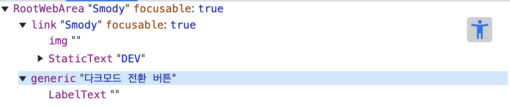
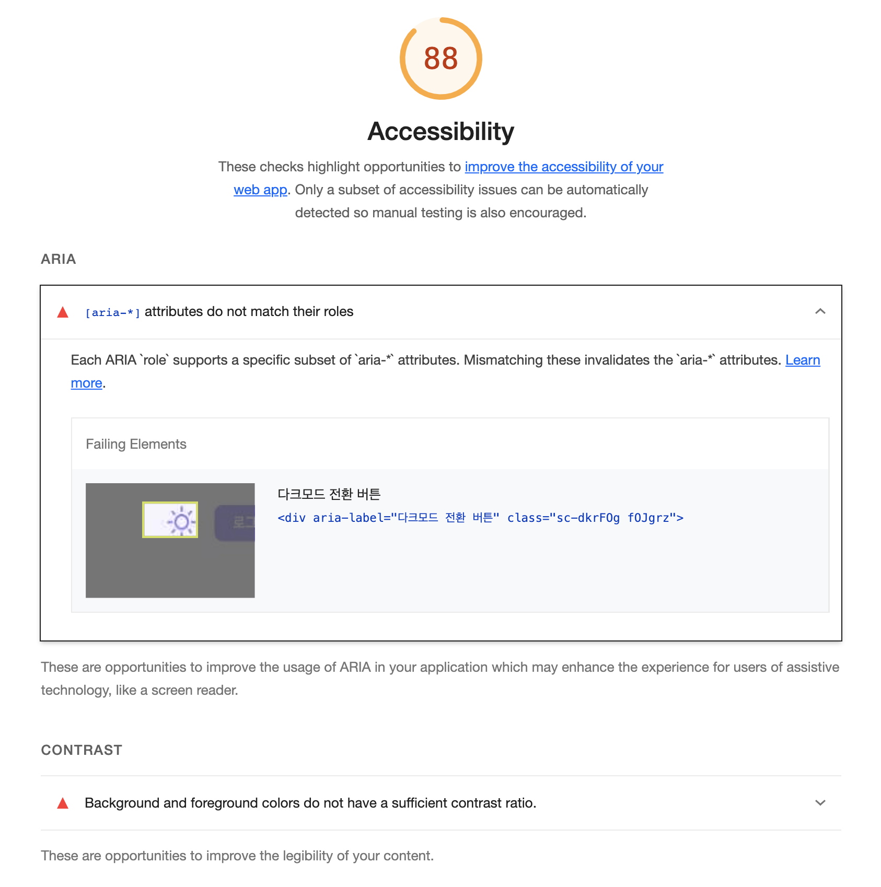
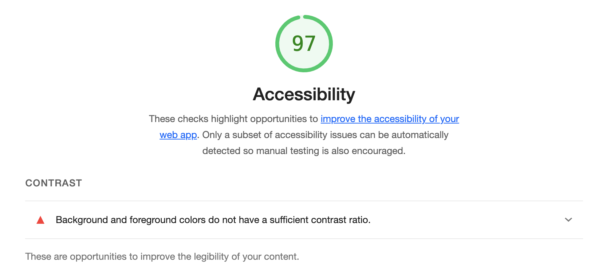
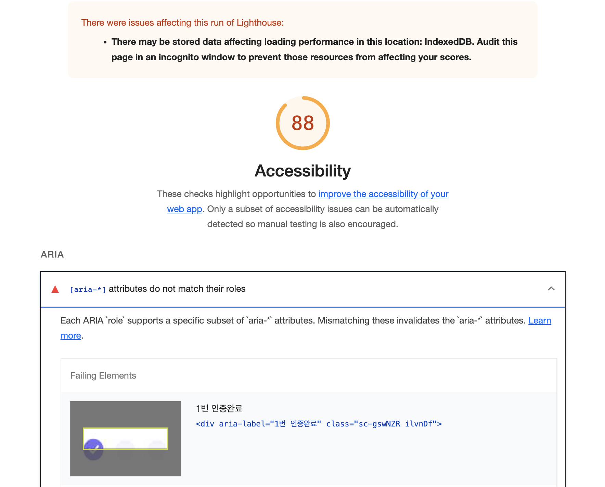
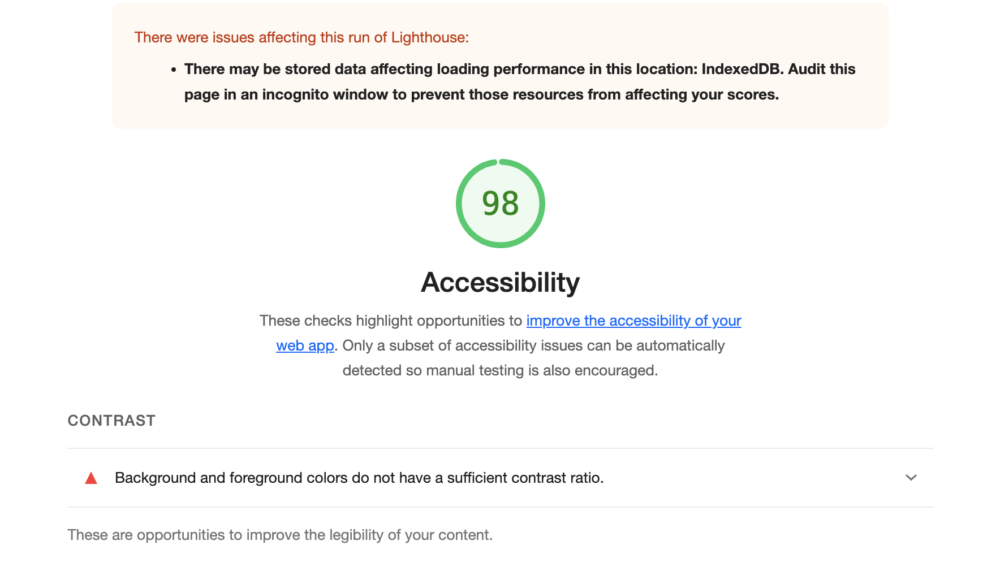
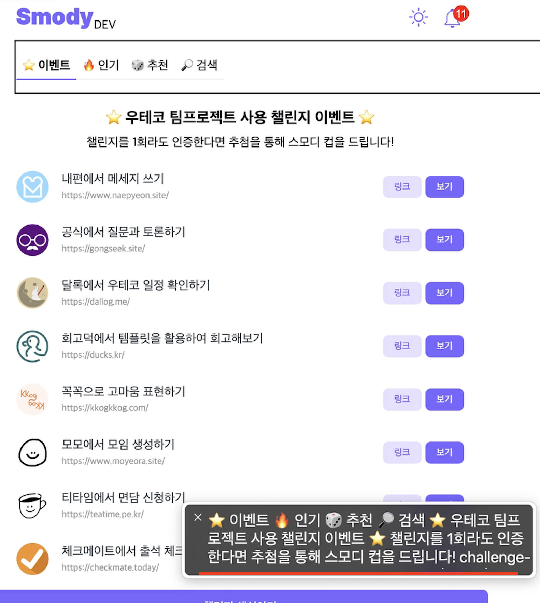
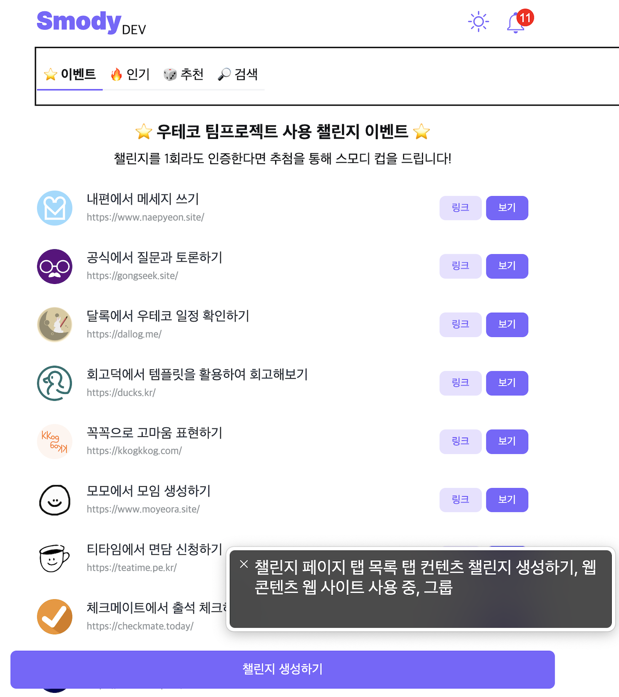
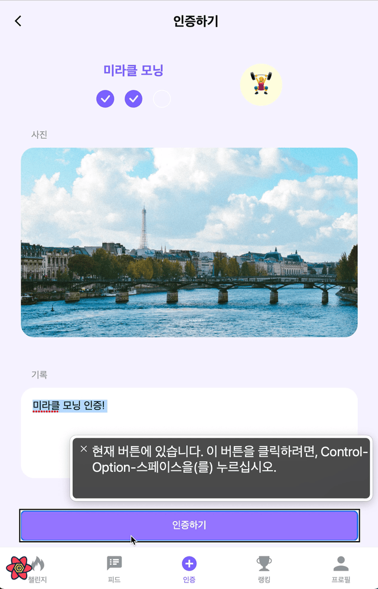
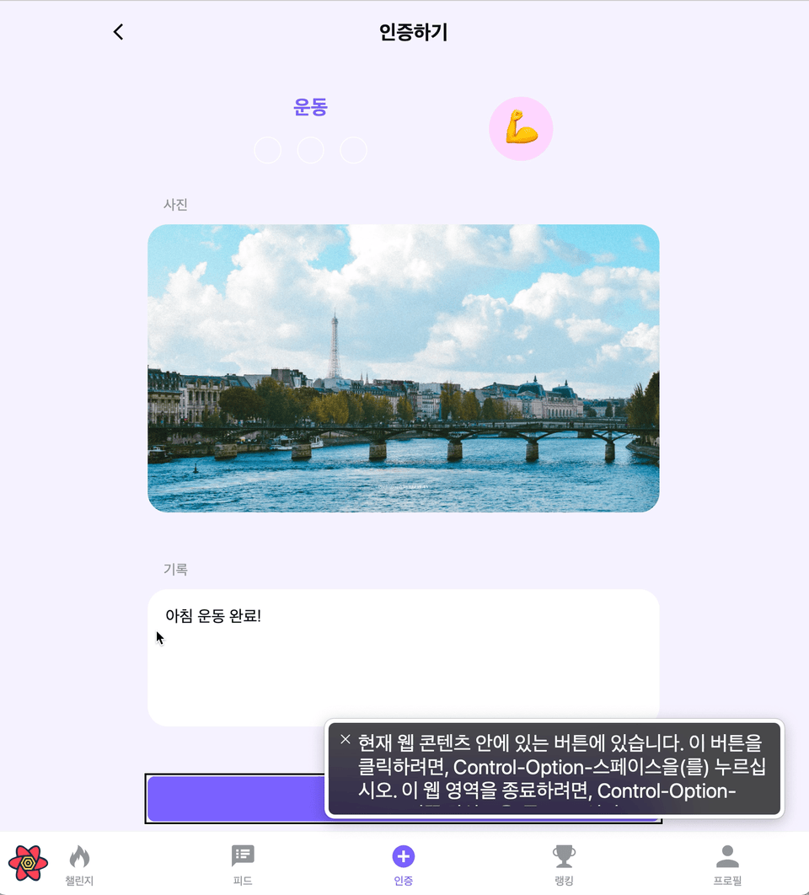

import { MDXImageWrapper } from 'components';

# 들어가며
이번 글에서는 스모디 서비스의 웹 접근성을 개선한 사례에 대해 정리하려한다.

# [aria-*] attributes do not match their roles 문제 해결

메인 페이지와 피드 페이지에서 Lighthouse로 접근성 점수를 측정한 결과 다음과 같은 문제가 발견됐다.

<br/>

```bash
[aria-*] attributes do not match their roles
```

<br/>

위 문제는 특정 role을 가진 태그에 부적절한 aria-* 속성을 사용할 때 발생한다. 따라서 해당 문제를 해결하기 위해서는 **사용한 aria-* 속성을 제거하거나 태그의 role을 수정**해야한다.

<br/>

## 메인 페이지 개선

메인 페이지에서 원인이 되는 코드는 다음과 같다.

<br/>

```tsx
export const DarkModeButton = (props) => {
	...
  return (
    <div aria-label="다크모드 전환 버튼">
			<input
				id="darkModeCheckbox"
        type="checkbox"
        checked={checked}
        onChange={handleChange}
			/>
			<label htmlFor="darkModeCheckbox"/>
    </div>
  );
};
```

<br/>

접근성 트리를 통해 사용된 div 태그의 role을 확인하면 generic인 것을 확인할 수 있다.

<br/>

<MDXImageWrapper caption="접근성 트리로 확인한 div 태그의 role">
  
</MDXImageWrapper>

<br/>

MDN에 generic role에 관한 문서에는 다음과 같이 명시돼 있다.

<br/>

> The element with `role="generic"` should not have an accessible name or role description.
> 

<br/>

따라서 div 태그에 적용된 aria-label을 제거했다. 또한 기존의 aria-label 속성은 label에 사용하여 스크린리더가 올바르게 버튼을 읽을 수 있도록 했다. 문제를 해결 후 코드는 다음과 같다.

<br/>

```tsx
export const DarkModeButton = (props) => {
	...
  return (
    <div>
			<input
				id="darkModeCheckbox"
        type="checkbox"
        checked={checked}
        onChange={handleChange}
			/>
			<label htmlFor="darkModeCheckbox" aria-label="다크모드 전환 버튼"/>
    </div>
  );
};
```

<br/>

개선 전 접근성 점수

<MDXImageWrapper caption="generic role 문제 개선 전 접근성 점수">
  
</MDXImageWrapper>

<br/>

개선 후 접근성 점수

<MDXImageWrapper caption="generic role 문제 개선 후 접근성 점수">
  
</MDXImageWrapper>

<br/>

## 피드 페이지의 문제

피드 페이지에서 문제도 role이 generic div 태그에 aria-label 속성을 사용한 것이 원인이었다.

<br/>

문제가 발생된 코드는 다음과 같다.

```tsx
export const CheckCircles = ({ progressCount }: CheckCirclesProps) => {
	...
  return (
    <div gap="1rem" aria-label={`${progressCount}번 인증완료`}>
      {totalCheck.map((_, index) => (
        <Element
          key={index}
          checkCircleCount={index}
          progressCount={progressCount}
        />
      ))}
    </div>
  );
};
```

<br/>

위 코드에서 div는 하위 UI 요소들을 묶기 위한 용도로 사용됐다. 또한 하위 요소들이 모두 accessible name이 없었기 때문에 div 태그에 aria-label을 사용해야했다. 때문에 문제를 해결하기 위해 div 태그의 role을 바꿔주는 방법을 사용했다. 

<br/>

MDN에서 확인한 결과 UI를 묶어주는 적절한 role이 group인 것을 확인했다. 따라서 div 태그에 role을 적용했고 코드는 다음과 같다.

<br/>

```tsx
export const CheckCircles = ({ progressCount }: CheckCirclesProps) => {
	...
  return (
    <div gap="1rem" role="group" aria-label={`${progressCount}번 인증완료`}>
      {totalCheck.map((_, index) => (
        <Element
          key={index}
          checkCircleCount={index}
          progressCount={progressCount}
        />
      ))}
    </div>
  );
};
```

개선 전 접근성 점수

<MDXImageWrapper caption="group role 적용 전 접근성 점수">
  
</MDXImageWrapper>

<br/>

개선 후 접근성 점수

<MDXImageWrapper caption="group role 적용 후 접근성 점수">
  
</MDXImageWrapper>

<br/>

# 페이지 내용을 전부 읽어주는 문제 해결

스크린 리더로 챌린지 페이지의 내용을 포커스 하면 페이지에 있는 내용을 전부 읽어주는 문제가 발견됐다.

<br/>

<MDXImageWrapper caption="스크린 리더가 페이지의 있는 내용을 전부 읽어주는 문제">
  
</MDXImageWrapper>

<br/>

페이지의 구조를 파악하기 전에 내용을 읽어주면 스크린 리더 사용자에게 혼란을 야기할 것이라 판단했다. 따라서 페이지에 포커스 하면 페이지 구조를 읽어주도록 개선했다.

<br/>

이를 위해  적용한 방법은 다음과 같다.

- 챌린지 탭 목록에 aria-label을 적용하여 **“챌린지 페이지 탭 목록”**이라고 읽도록 수정
- 챌린지 탭 컨텐츠 영역에 aria-label을 적용하여 **“탭 컨텐츠”**라고 읽도록 수정
- 컨텐츠 영역의 각 페이지에 **section 및 h 태그** 적용

<br/>

수정 사항이 적용된 결과는 다음과 같다.

<MDXImageWrapper caption="스크린 리더가 페이지의 있는 내용을 전부 읽어주는 문제 해결">
  
</MDXImageWrapper>

<br/>

# 모달을 포커스 하도록 개선

스모디 서비스에서는 인증이 완료된 후 축하와 재도전을 응원하는 모달이 팝업된다. 일반 모니터를 통해 서비스를 이용하는 사용자라면 모달이 팝업된 것을 쉽게 인지할 수 있다. 그러나 스크린리더 사용자라면 모달이 팝업됐을 때 아무런 동작이 없다면 모달이 팝업된 것을 인지하기 어려울 수 있다. 따라서 모달 영역으로 포커스를 이동할 필요가 있다.

<br/>

<MDXImageWrapper style={{ maxWidth: '300px' }} caption="웹 전근성 개선 - 모달이 포커스 안되는 예시">
  
</MDXImageWrapper>

<br/>

안타깝게 개선 전에 스모디 서비스에서는 모달이 팝업돼도 포커스가 이동하지 않았다.

<br/>

모달에 포커스가 이동되게 만들기 위해 role=”dialog” 속성을 추가했습니다. 하지만 스크린리더가 dialog role을 지원하지 않는다면 포커스가 이동하지 않습니다.

따라서 추가로 모달이 팝업됐을 때 모달 요소의 focus() 메서드를 호출하도록 구현했습니다. 또한 현재 모달 컴포넌트의 경우 div 태그로 구현됐기 때문에 포커스를 받기 위해서 tabIndex 속성을 0으로 설정했습니다.

<br/>

모달 컴포넌트의 대략적인 코드는 다음과 같습니다.

```tsx
export const Modal = ({ children }) => {
  const modalRef = useRef<HTMLDivElement>(null);

  useEffect(() => {
    modalRef.current?.focus();
  }, []);

  return (
    <>
      {ReactDOM.createPortal(
        <Modal ref={modalRef} role="dialog" tabIndex={0}>
          {children}
        </Modal>,
        document.getElementById('overlay-root') as HTMLElement,
      )}
    </>
  );
};
```

<br/>

추가로 모달의 팝업됐을 때 다른 영역으로 스크린리더의 포커스가 이동하는 것을 방지하기 위해서 모달 이외의 영역에는 aria-hidden 속성을 추가했습니다.

<br/>

코드 개선 후 결과는 다음과 같다.

<br/>

<MDXImageWrapper style={{ maxWidth: '300px' }} caption="웹 접근성 개선 - 모달 포커스 예시">
  
</MDXImageWrapper>

<br/>

# 마무리

아직 스모디 서비스에는 접근성을 개선할 부분이 많다. 따라서 더 많은 사용자분이 편하게 서비스를 이용할 수 있도록 접근성 부분을 더 개선할 필요가 있다.
