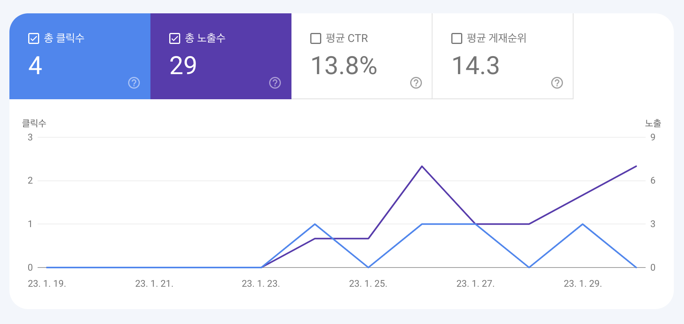
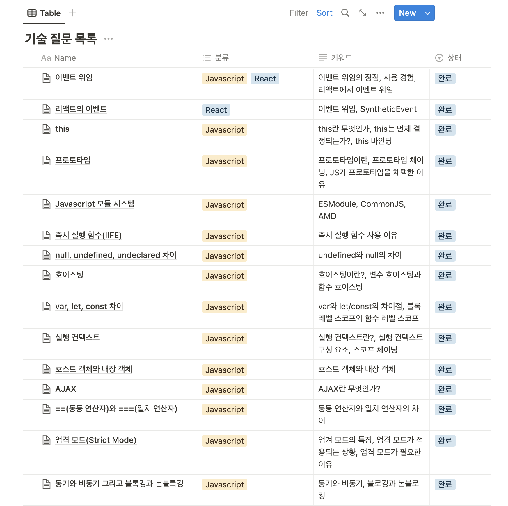

import { MDXImageWrapper, ToggleList } from 'components';

## 들어가며
2023년이 되면서 세운 목표 중 하나는 주기적으로 회고를 작성하는 것이다. 그리고 가벼운 마음으로 올해는 한 달을 주기로 월간 회고를 작성하기로 결정했다.

예년과 다르게 올해는 아무 곳에도 속하지 않은채 시작한 특별한 해이다. 작년 말까지만 해도 마음에 여유를 갖고 시작하자고 스스로 했던 다짐이 무색하게 1주일도 지나지않아 조급한 마음이 생겨버렸다.
하지만 소속이 없기에 더 능동적이며 주도적으로 계획을 세울고 이행할 수 있었다. 

이번 달에 했던 굵직한 일을 돌아보면 다음과 같다.

 

## 네트워크 공부
기술 면접을 준비하면서 TCP, IP 등의 네트워크 개념을 공부했지만 깊게 알고있지 않다고 스스로 느꼈다.
아마 면접에서 네트워크 관련된 one-depth 질문에는 답했을지라도, two-depth 이상의 질문에는 답하지 못했을 것이다.
가령 "TCP는 어떤 특징을 가고 있나요?"라는 질문이 들어왔을 때는 무난하게 답변할지라도, "혼잡제어의 원리에 대해 설명해주세요."라는 질문을 받는다면 "그 부분에 대해서는 아직 잘 모르겠습니다. 다시 공부할 필요가 있을 거 같습니다."라는 아쉬운 답변을 했을 것이다.

 

네트워크에 분야에 대한 무지함을 보완하고자 "학부생 수준의 네트워크 지식"을 갖추는 것을 목표로 삼았다.
그리고 여러 사람이 추천을 하는 [한양대학교 이석복 교수님](http://www.kocw.net/home/cview.do?cid=6b984f376cfb8f70)의 네트워크 강의를 완강했다.
이 강의 덕분에 클라이언트에서 서버로까지 요청의 흐름을 명확하게 알게 되었고, 네트워크에 대해 자신감이 생겼다.
더불어 연초 첫 목표를 달성하면서 성취감도 느낄 수 있었다.

 

## 블로그 작업
이전부터 가지고 있던 바램이 있었는데, 바로 "나를 위한 사이트"를 만드는 것이었다. "나를 위한 사이트"라는 말이 거창하지만, 그냥 개인 블로그와 포트폴리오 사이트를 만드는 것이었다.
이를 위해 지난 달 개인 블로그를 배포했고 이어서 이번 달에는 포트폴리오 페이지를 구현했다.
포트폴리오 페이지를 비롯해 블로그를 만들면서 몇몇 아쉬움 점과 새로운 목표들이 생겼다.

 

첫 번째 아쉬움은 이력으로 적을만한 경험이 없다는 것이다.
그나마 이력으로 작성할 수 있는 부분은 1년동안 창업 팀에 속해 ATSAY를 개발한 경험인데, 팀의 규모가 작기도 했지만 스스로 느꼈을 때 현업에서의 경험이라고 하기엔 부족한 부분이 많아서 적지않았다.
이런 아쉬움을 극복하고자 올해는 "더 크고 성장하는 경험을 할 수 있는 팀에 합류하는 것"이 목표다. 더불어 12월 월말 회고에서 어떠한 점에서 성장을 이루었는지 돌아보면 재밌을 거 같다. 

 

두 번째 아쉬움은 블로그 게시글을 기록 용도로만 사용한다는 것이다.
블로그 게시글은 기록의 용도를 넘어서 공유를 통해 가치를 창출할 수 있을 것이다.
게시글의 공유를 통해 내가 이루고자 하는 것은 프론트엔드 생태계에 기여하는 것과 나의 브랜드 가치를 높이는 것이다.

 

목표 달성의 일환으로 우선 블로그 글이 다른 사람에게 잘 노출될 수 있도록 SEO 작업을 수행했다.
추가로 구글의 Search Console을 통해 구글 검색 실적을 살펴보고있다.

 

<MDXImageWrapper caption="구글 Search Console 통계">
  
</MDXImageWrapper>

 

항상 그렇듯 시작은 소소하다. 하지만 꾸준히 글을 작성하면 방문자 수가 점차 늘어날 것이라 생각한다.
현재 블로그에는 24개의 글이 게시돼 있다. 매달 4개의 글을 작성한다고 가정했을 때, 연말에는 60개 이상의 글이 게시될 것이다.
작성한 모든 게시글이 매일 사람들에게 노출되어 클릭되면 좋겠지만 이는 쉽지 않을 것이다. 작성한 게시글의 반 이상 하루에 한 번씩 조회되는 것을 목표로 삼았다.
조금 더 구체적으로 적으면 "연말에 일간 방문자 수 30명 달성!"이다.

 

## 기술 면접 질문 정리
지난해 처음으로 기술 면접을 준비했다. 당시에 질문 목록을 체계화하자는 취지로 마인드맵을 통해 키워드를 구조화하고, 상세 내용은 노션을 통해 기록했다.
하지만 두 곳에 기록해두니, 다시 이들을 참고해서 공부하기 불편했다. 따라서 이번 기회에 노션의 Table 기능을 이용해서 다시 정리했다.

 

<MDXImageWrapper caption="노션을 통한 기술 면접 질문 정리">
  
</MDXImageWrapper>

 

현재는 Javascript, React, Typescript에 관한 내용만 정리한 상태이다. 앞으로는 네트워크, OS 등의 내용도 추가할 예정이다.

 

## 1일 1PS 한 달동안 성공
1일 1커밋, 일명 "잔디심기"를 지난해 말부터 다시 시작했다. 그리고 오래도록 꾸준히 도전을 이어 나가고자, 부담이 되지 않게 "1일 1PS"를 하고 있다.
언어도 이전과 다르게 Javascript로 문제를 풀고 있는데, 덕분에 ES6에서 도입된 배열의 고차함수를 더 능숙하게 사용하게 되었다. 
가령 `Array.prototype.forEach`는 `break` 구문을 사용할 수 없는데, 그럼에도 반복문의 특정 조건을 만족할 때 순회를 중단하고 싶다면 `Array.prototype.some`을 고려해서 사용한다.
이외에도 `Map`, `Set` 등의 자료구조를 사용하는 것도 익숙해졌다.
그리고 무엇보다 꾸준히 연습한 덕분에 코딩 테스트를 가볍게 통과한 성과를 내기도 했다!

 

## 앞으로
올해는 예년보다 더 빠르게 시간이 흐르는 느낌이다. 빠르게 흘러가는 시간이 낭비되지 않게 세웠던 목표를 위해 꾸준히 노력해야 한다.
이번 달을 돌아봤을 때 아쉬운 점은 책을 많이 읽지 않았다는 것이다. 도서관에서 주기적으로 책을 대출하고 있지만, 어느 순간부터 빌려온 책을 읽지 않는 것이 반복되고 있다.
때문에 "호모데우스"를 세 번째 대출받고 있지만, 아직 다 읽지 못했다.
그래서 2월에는 "대출한 책 한 권을 완독하기"를 목표로 틈틈이 독서하려 한다.
