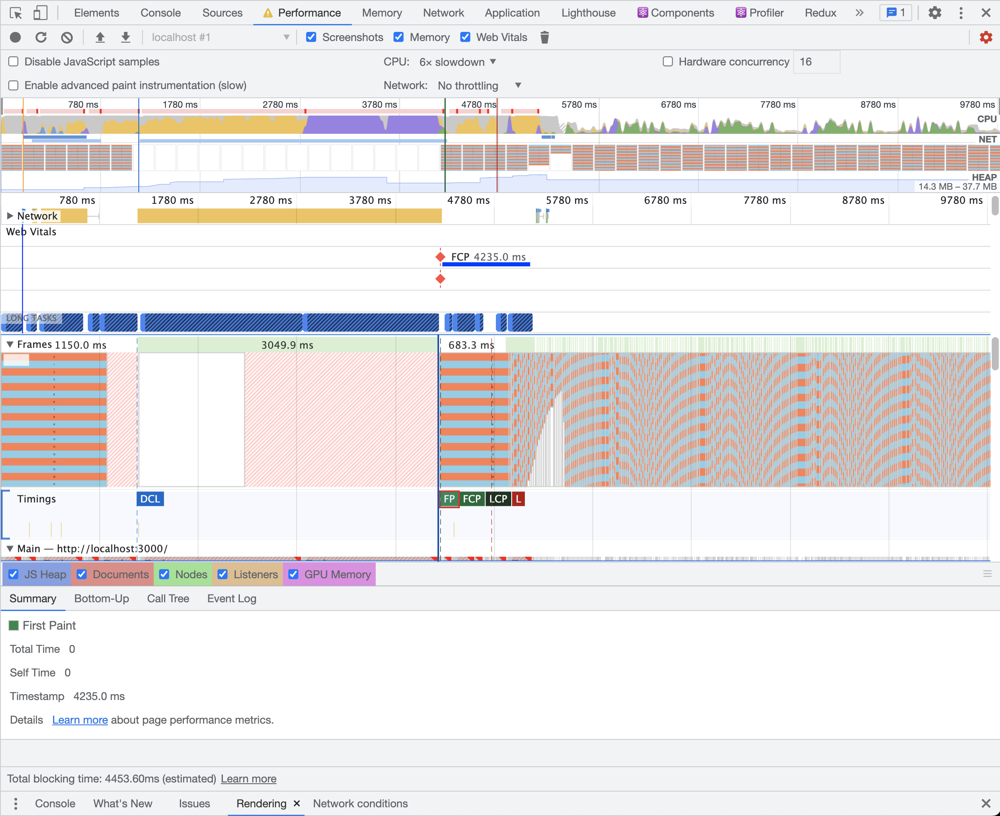
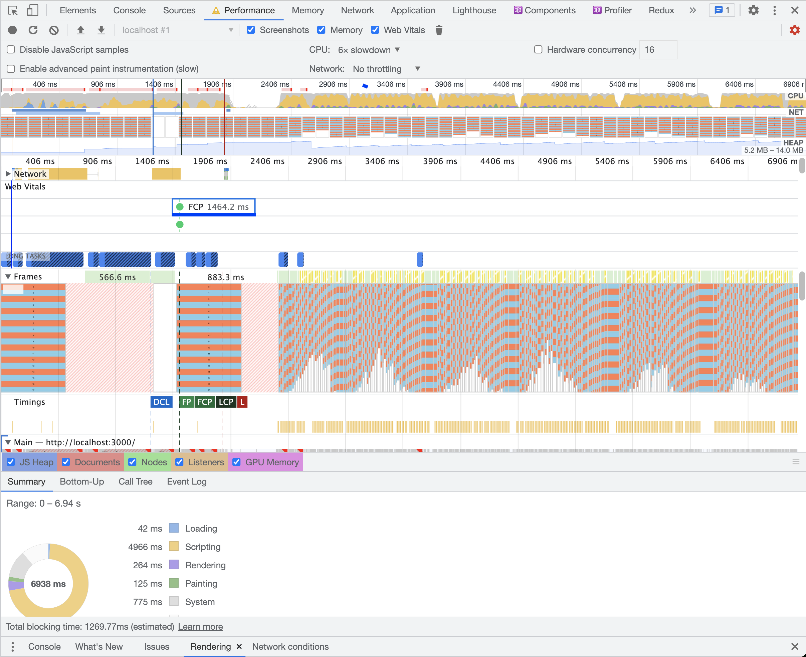
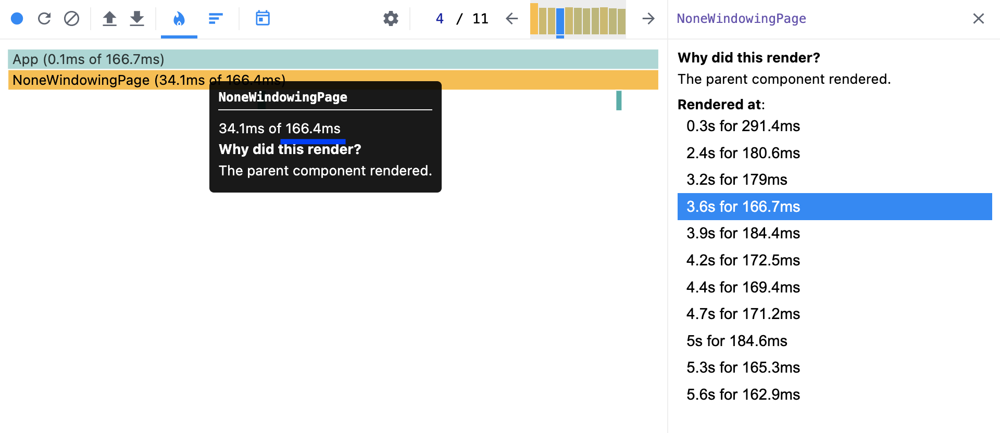
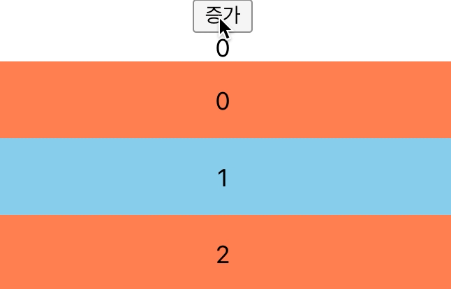
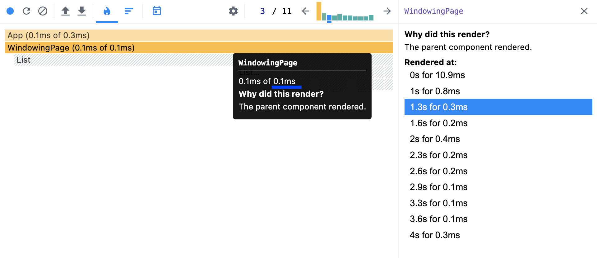
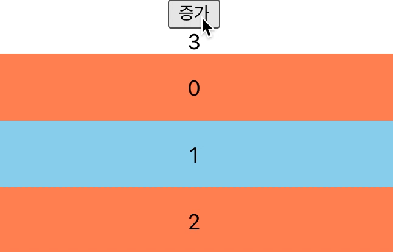

import { MDXImageWrapper, ToggleList } from 'components';

## 들어가며

> 만약 만들고 있는 서비스가 성공해서 100만 개의 피드 데이터가 생성됐을 때, 모든 피드 데이터를 브라우저에 렌더링하게 된다면 어떻게 될까요? 그리고 이를 최적화할 방법은 무엇이 있을까요?
> 

<br />

경험 많은 프론트엔드 개발자님에게 받은 질문이다. 많은 DOM 요소가 브라우저에 렌더링 된다면, 당연히 렌더링 시간이 오래 걸릴 것이고 이는 사용자 경험을 떨어뜨릴 것이다. 따라서 위 문제는 사용자가 많은 큰 규모의 서비스에서는 반드시 고려해야 한다. 
하지만 위 문제에 대한 구체적인 해결 방법은 떠오르지 않았다. 따라서 당시에는 아래와 같이 모호하게 답변했다.

<br />

> React Native로 개발할 당시에 학습한 내용이 떠오릅니다. React Native의 FlatList의 경우 많은 DOM 요소가 렌더링되는 상황에서 최적화가 적용돼 있다고 들었습니다. 따라서 위와 같은 최적화 작업이 필요한 시점에 FlastList를 참고하여 해결 방안을 모색할 거 같습니다.
> 

<br />

이후 질문에 대해서 찾아보니 [React 공식 문서](https://ko.reactjs.org/docs/optimizing-performance.html#virtualize-long-lists)에서 `windowing` 기법이라는 키워드를 찾을 수 있었다.

<br />

이번 글에서는 windowing 기법이 무엇이며, 최적화 전후의 상황을 비교하면서 windowing 기법의 효과를 실험을 통해 알아보려 한다. 또한 windowing 기법이 구현된 [react-window](https://github.com/bvaughn/react-window) 라이브러리를 참고하여 구현 원리에 대해 정리하려한다.

## windowing 기법이란?

> 애플리케이션에서 긴 목록(수백 또는 수천행)을 렌더링하는 경우 ‘windowing’이라는 기법을 사용하는 것을 추천합니다. 이 기법은 주어진 시간에 목록의 부분 목록만 렌더링하며 컴포넌트를 다시 렌더링하는 데 걸리는 시간과 생성된 DOM 노드의 수를 크게 줄일 수 있습니다.
> 

리액트 공식 문서에 windowing 기법에 대한 설명은 위와 같다. windowing 기법을 사용하면 많은 양의 데이터가 존재해도 한 번에 렌더링하는 것이 아니라 일부분만 렌더링하여 렌더링 시간을 줄일 수 있다.

<br />

### react-window와 react-virtualized

react에서 windowing 기법을 적용할 수 있는 라이브러리는 대표적으로 [react-window](https://github.com/bvaughn/react-window)와 [react-virtualized](https://github.com/bvaughn/react-virtualized) 두 가지가 있다.

<br />

두 라이브러리 모두 레포지터리 주인은 [bvaughn](https://github.com/bvaughn)님이다. bvaughn님은 react-virtualized를 구현한 후, 기능은 적지만 크기가 작고 더 빠른 버전인 react-window 라이브러리를 추가로 배포했다 한다. 

두 라이브러리에 대한 차이점은 [여기서](https://github.com/bvaughn/react-window#how-is-react-window-different-from-react-virtualized) 확인할 수 있다.

<br />

두 라이브러리 모두 windowing 기법이 적용됐다. 이번 학습의 목적은 windowing 기법의 효과와 구현 원리에 대해 알아보는 것이므로 더욱 간단하게 구현된 react-window 라이브러리를 이용해서 학습을 진행했다.

## windowing 기법 적용 전후 성능 비교

### 성능 비교 환경과 조건

windowing 기법 적용 전후의 렌더링 성능을 비교하면서 windowing 기법의 효과를 확인하려한다.

<br />

성능 비교는 Chrome Devtools을 이용했으며 제약 사항은 아래와 같다.

- CPU throttling: 6x slowdown
- Network throttling: No throttling

<br />

성능 비교를 위해 10,000개의 List 요소를 렌더링하고 Chrome Devtools로 성능을 측정했다.

<br />

### windowing 기법 적용 전후 비교

**windowing 기법 적용 전**

<ToggleList summary="windowing 기법 적용 전 코드">
  ```jsx
  import { useState } from "react";
  import { ListItem } from "../components";
  
  const NoneWindowingPage = () => {
    const [dummy, _] = useState(() => new Array(10000).fill(0));
  
    return (
      <>
        {dummy.map((_, index) => (
          <ListItem key={index} order={index} />
        ))}
      </>
    );
  };
  
  export default NoneWindowingPage;
  ```
</ToggleList>    

<br />

위 코드는 10,000개의 React 요소를 생성하는 코드이다. 때문에 실제 DOM에 요소가 (10,000 + a)개 만큼의 요소가 생성된다.

<br />

해당 코드를 적용한 성능 측정 결과는 다음과 같다.

<br />

<MDXImageWrapper caption="windowing 기법 적용 전 렌더링 성능">
  
</MDXImageWrapper>

<br />

성능 측정 결과 **FCP가 4,235ms**인 것으로 확인됐다. FCP 지표가 안 좋은 만큼 실제로 페이지가 렌더링 되는 속도가 느린 것이 체감됐다.

<br />

💡 web vitals 기준에 따르면 좋은 사용자 경험을 제공하기 위해서 FCP는 1,800ms 이하로 유지하는 것을 권장한다.

<br />

**windowing 기법 적용 후**

<ToggleList summary="windowing 기법 적용 후 코드">
  ```jsx
  import { useState } from "react";
  import { ListItem } from "../components";
  import { FixedSizeList } from "react-window";
  
  const ListItemRow = ({ index, style }) => (
    <ListItem style={style} order={index} />
  );
  
  const WindowingPage = () => {
    const [dummy, _] = useState(() => new Array(10000).fill(0));
  
    return (
      <FixedSizeList height={894} itemCount={10000} itemSize={50} width={"100%"}>
        {ListItemRow}
      </FixedSizeList>
    );
  };
  
  export default WindowingPage;
  ```
</ToggleList>
    
<br />

react-window 라이브러리를 이용해서 windowing 기법을 적용하면 10,000개의 DOM 요소를 생성하진 않는다. [라이브러리 공식 문서](https://github.com/bvaughn/react-window)에도 나와 있듯이 많은 데이터의 일부분만 실제로 DOM 요소로 생성한다.

<br />

해당 코드를 적용한 성능 측정 결과는 다음과 같다.

<br />

<MDXImageWrapper caption="windowing 기법 적용 후 렌더링 성능">
  
</MDXImageWrapper>

<br />

성능 측정 결과 FCP가 이전 보다 개선된 1,464.2ms으로 확인됐다.

<br />

하지만 Frame 영역을 보면 [Partially Presented Frame](https://developer.chrome.com/blog/new-in-devtools-100/#perf)을 확인할 수 있다. 또한 CPU 영역을 통해서 Scripting의 CPU 점유율이 높은 것을 확인할 수 있다. 페이지가 렌더링된 이후에 계속 스크롤했기 때문에 스크롤 이벤트에 부착된 이벤트 핸들러에서 무거운 연산 작업이 수행되는 것을 유추할 수 있다.

<br />

💡 성능을 측정할 때 CPU에 throttling을 걸어서 Partially Presented Frame이 많이 확인됐지만, throttling 없이 성능을 측정하면 Partially Presented Frame이 거의 없는 것으로 확인됐다.

<br />

### 실제로 windowing 기법을 적용할 필요가 있는가?

성능을 측정한 후 아래와 같은 생각을 했다.

> windowing 기법을 적용하면 스크롤 할 때마다 연산을 하게 되는데, 오히려 불필요한 연산을 하는 게 아닐까?
> 

<br />

또한 실제 서비스에서는 모든 데이터를 한 번에 불러오지 않는다. 대신 무한 스크롤 방식을 이용해서 데이터를 조금씩 조회하고 DOM 요소로 생성한다. 때문에 windowing 기법의 적용 전후의 FCP 차이도 위 실험 결과만큼 크지 않을 것이다.

<br />

windowing 기법을 적용하지 않으면 아래와 같은 문제가 발생한다고 생각하기 때문에 windowing 기법이 필요하다고 판단했다.

<br />

1. 많은 DOM 노드를 생성하면 그만큼 많은 메모리 필요하다.
2. 많은 DOM 노드를 생성하면 React에서 상태를 업데이트 할때, VirtualDOM을 비교하는 시간이 오래 걸린다.
    
    DOM 노드가 많아진다면 VirtualDOM의 노드 수도 비례해서 증가한다. 
    
    예를들어 10,000개의 데이터를 windowing 기법을 적용하지 않고 렌더링하면 (10,000 + a) 개의 노드가 생성된다. 따라서 상태를 업데이트할 때마다 (10,000 + a) 개의 노드를 전부 비교해야 한다.
    
    하지만, widnowing 기법을 적용하여 실제로 10개의 노드만 생성하게 된다면 상태를 업데이트할 때마다 (10 + a)개의 노드만 비교하면 된다.
    

<br />

실제로 windowing 적용 전후의 상태 값 업데이트 시간을 비교하기 위한 실험을 진행했다.

실험은 count라는 상태 값을 생성한 후 button을 통해 count 상태 값을 증가시키면서 렌더링 시간과 업데이트된 화면을 확인하는 방식으로 진행됐다.

<br />

<ToggleList summary="실험에 사용된 코드">
  ```jsx
  import { useState } from "react";
  import NoneWindowingPage from "./pages/NoneWindowingPage";
  import WindowingPage from "./pages/WindowingPage";
  import "./App.css";
  
  function App() {
    const [count, setCount] = useState(0);
  
    const handleClickIncrease = () => {
      setCount(count + 1);
    };
  
    return (
      <div className="App">
        <button onClick={handleClickIncrease}>증가</button>
        <div>{count}</div>
        <NoneWindowingPage />
        {/* <WindowingPage /> */}
      </div>
    );
  }
  
  export default App;
  ```
</ToggleList>

<br />

**windowing 기법 적용 전**

<MDXImageWrapper caption="windowing 기법 적용 전 react profiler">
  
</MDXImageWrapper>

<br />

windowing 기법을 적용하기 전 렌더링 시간은 약 166ms 결렸다.

CPU throttling을 x6 slowdown으로 설정하고 실제 화면을 테스트한 화면은 아래와 같다.

버튼을 눌러서 상태 값을 1씩 증가시키지만 화면의 렌더링되는 숫자는 상태 값의 변화를 즉각적으로 반영하지 못하는 모습을 확인할 수 있다.

<br />

<MDXImageWrapper caption="windowing 기법 적용 전 화면">
  
</MDXImageWrapper>

<br />

**windowing 기법 적용 후**

<MDXImageWrapper caption="windowing 기법 적용 후 react profiler">
  
</MDXImageWrapper>

<br />

windowing 기법을 적용한 후 렌더링 시간은 약 0.1ms 걸렸다.

<br />

windowing 기법을 적용한 후 동일하게 CPU throttling을 적용하여 화면을 테스트한 결과 상태 값의 변화가 즉각적으로 반영되는 것을 확인할 수 있다.

<MDXImageWrapper caption="windowing 기법 적용 후 화면">
  
</MDXImageWrapper>

<br />

위 실험을 통해 DOM 노드의 수가 많아지면 상태 값을 업데이트하는 데 소요되는 시간도 증가한다는 것을 알 수 있었다. 그리고 이는 긴 리스트 데이터를 렌더링할 때 windowing 기법의 필요성을 보여준다.

<br />

## windowing 기법 원리 with react-window

windowing 기법의 원리를 파악하기 위해서 react-window 라이브러리를 확인했다.

<br />

라이브러리의 코드를 확인해보면 이번 학습에서 사용한 [FixedSizeList](https://github.com/bvaughn/react-window/blob/master/src/FixedSizeList.js) 컴포넌트는 createListComponent 함수를 통해 생성되는 것을 확인할 수 있다.

<br />

createListComponent는 클래스형 컴포넌트를 반환하는 함수이다. 반환하는 클래스형 컴포넌트의 render 메서드는 대략 아래와 같다. render 메서드는 리스트 데이터를 감싸는 부모 컴포넌트와 리스트 데이터에 해당되는 자식 컴포넌트를 반환한다.

```jsx
render() {
  const { ... } = this.props;
  const { isScrolling } = this.state;

  ...

  const [startIndex, stopIndex] = this._getRangeToRender();

  const items = [];
  if (itemCount > 0) {
    for (let index = startIndex; index <= stopIndex; index++) {
      items.push(
        createElement(children, {
          data: itemData,
          key: itemKey(index, itemData),
          index,
          isScrolling: useIsScrolling ? isScrolling : undefined,
          style: this._getItemStyle(index),
        })
      );
    }
  }

  ...

  return createElement(
    outerElementType || outerTagName || 'div',
    {
      className,
      onScroll,
      ref: this._outerRefSetter,
      style: {
        position: 'relative',
        height,
        width,
        overflow: 'auto',
        WebkitOverflowScrolling: 'touch',
        willChange: 'transform',
        direction,
        ...style,
      },
    },
    createElement(innerElementType || innerTagName || 'div', {
      children: items,
      ref: innerRef,
      style: {
        height: isHorizontal ? '100%' : estimatedTotalSize,
        pointerEvents: isScrolling ? 'none' : undefined,
        width: isHorizontal ? estimatedTotalSize : '100%',
      },
    })
  );
}
```

render 메서드의 핵심이 되는 부분은 **startIndex와 stopIndex를 계산한 후, 이 범위에 속하는 데이터에 대한 컴포넌트를 createElement 함수를 통해 생성하는 것이다.** 또한 각 데이터에 대한 컴포넌트 `position: absolute` 스타일이 적용돼 있고, index에 따라 top(혹은 left) 값이 계산된다.

<br />

startIndex와 stopIndex는 내부 메서드인 _getRangeToRender를 통해 계산된다. 해당 메서드 내부에서는 scrollOffset 상태 값을 이용한다.

<br />

그리고 scrollOffset 상태 값은 _onScrollHorizontal 혹은 _onScrollVertical 메서드에서 변하게 되며, 해당  메서드는 render 메서드에서 반환되는 부모 컴포넌트의 onScroll props로 전달된다.

<br />

즉, 위 과정을 정리하면 다음과 같다.

1. 부모 컴포넌트에서 scroll 이벤트가 발생하면 scrollOffset 상태 값이 변하게 된다.
2. 상태 값이 변화되면서 render 메서드가 다시 호출된다. 때문에 startIndex와 stopIndex가 다시 계산되면서 렌더링되는 데이터가 변한다.
3. 다시 scroll 이벤트가 발생하면 1번 과정부터 반복하면서 새로운 데이터를 렌더링한다.

<br />

## 끝으로

이번 글은 아래와 같이 요약할 수 있다.

- 긴 리스트 데이터를 렌더링할 때는 windowing 기법을 사용할 수 있다.
- react-window와 react-virtualize는 windowing 기법을 적용한 라이브러리이다.
- react-window는 스크롤 이벤트가 발생했을 때 각 요소의 top(혹은 left) 스타일을 조절해서 요소의 위치를 변경한다.

<br />

## 참고 자료

[성능 최적화 - React](https://ko.reactjs.org/docs/optimizing-performance.html#virtualize-long-lists)

[GitHub - bvaughn/react-window: React components for efficiently rendering large lists and tabular data](https://github.com/bvaughn/react-window)

[react-window로 대형 리스트 가상화](https://web.dev/i18n/ko/virtualize-long-lists-react-window/)