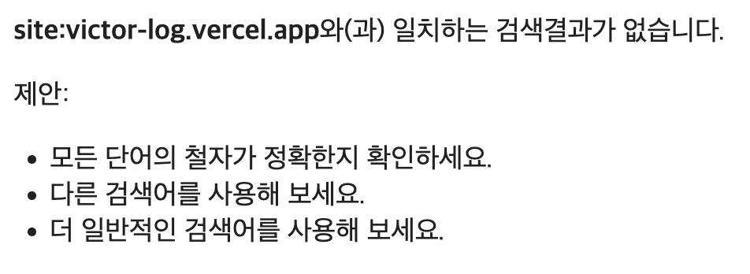
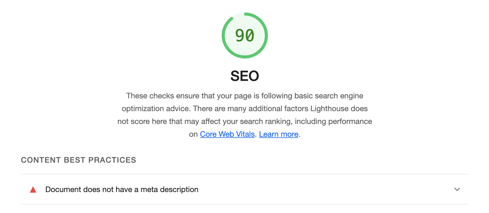
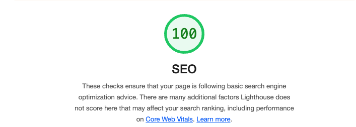
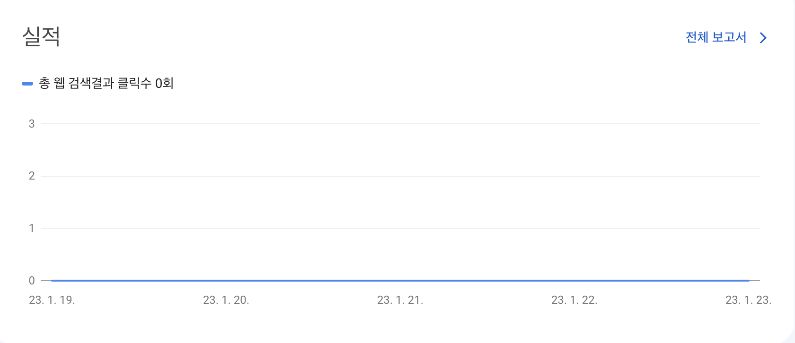

import { MDXImageWrapper } from 'components';

## 검색 엔진 최적화란 무엇인가?

<br />

> **SEO**(검색 엔진 최적화)는 웹사이트가 검색 결과에 더 잘 보이도록 최적화하는 과정입니다.
> 

<br />

## 검색 엔진 최적화를 위해 고려해야 하는 부분

### 내 사이트가 구글에 표시되는지 확인하기

> 사이트의 홈 URL을 `site:` 검색으로 확인합니다. 결과가 표시되면 색인에 포함되어 있는 것입니다. 예를 들어 `site:wikipedia.org`를 검색하면 [이러한 결과](https://www.google.com/search?q=site%3Awikipedia.org&hl=ko)가 반환됩니다.
> 

<br />

위 방법으로 [victor-log.vercel.app](http://victor-log.vercel.app)을 검색해보았다.

그 결과 구글에서 현재 블로그가 검색되지 않는 것으로 확인됐다.

<br />

<MDXImageWrapper caption="구글 검색 결과 사이트가 검색되지 않음">
  
</MDXImageWrapper>

<br />

### 구글 Search Console 사용하기

[Search Console](https://search.google.com/search-console/welcome?hl=ko)을 사용하면 사이트의 구글 검색 실적을 모니터링할 수 있다. 또한 구글이 사이트 내에서 중요한 문제를 발견하면 알림을 보내주는 기능도 제공한다.

<br />

## sitemap 정보 추가하기

> *사이트맵*은 사이트에 있는 페이지, 동영상 및 기타 파일과 그 관계에 관한 정보를 제공하는 파일입니다. Google과 같은 검색엔진은 이 파일을 읽고 사이트를 더 효율적으로 크롤링합니다.
> 

<br />

위는 사이트맵에 대한 구글 공식 문서의 설명이다. 사이트맵을 추가하면 구글 검색 엔진이 더 효과적으로 크롤링할 수 있도록 도울 수 있다.

<br />

### robots.txt 추가하기

> robots.txt 파일은 어떤 크롤러가 사이트의 어느 부분에 액세스할 수 있는지에 관한 규칙이 포함된 간단한 텍스트 파일입니다.
> 

<br />

위는 robots.txt 파일에 대한 구글 공식 문서의 설명이다. robots.txt를 이용하면 크롤러에게 크롤링이 가능한 페이지 정보를 전달할 수 있다.

<br />

### 명확한 제목 태그와 메타 설명 태그 사용하기

[구글의 검색엔진 최적화 기본 가이드](https://developers.google.com/search/docs/fundamentals/seo-starter-guide?hl=ko)에는 검색엔진이 페이지를 잘 읽을 수 있도록 돕기 위한 작업이 명시돼 있다. 명시된 방안을 모두 적용하는 것이 좋겠지만, 우선 여러 방안 중 가장 간단한 **제목 태그와 메타 설명 태그**를 적용하기로 결정했다.

<br />

## 목표

검색 엔진 최적화 작업에 앞서 아래와 같은 목표를 설정했다.

1. Lighthouse의 SEO 점수를 100점으로 만들기
2. `site:` 접두사를 이용해서 블로그 검색 시 구글에 노출되도록 하기
3. 구글 Search Console에 블로그를 등록시키고 통계 데이터 수집하기

<br />

## Gatsby로 만든 프로젝트에 검색 엔진 최적화 적용하기

### sitemap 정보 추가하기

sitemap 정보는 sitemap.xml 파일을 통해 제공할 수 있다. sitemap 정보는 사이트에 있는 페이지에 대한 정보이다. 따라서 새로운 페이지가 추가될 때마다 sitemap을 다시 만들어야한다. 

<br />

다행히 gatsby에서는 빌드를 할 때마다 sitemap.xml 파일을 생성해주는 [gatsby-plugin-sitemap](https://www.gatsbyjs.com/plugins/gatsby-plugin-sitemap/) 플러그인이 존재한다. 이 플러그인을 사용하기 위한 방법은 아래와 같다.

<br />

1. gatsby.config.js 파일에 siteMetadata 정보 추가하기
    
    [공식 문서](https://www.gatsbyjs.com/docs/reference/config-files/gatsby-config/#sitemetadata)에 따르면 siteMetadata는 사이트에서 공통으로 사용되는 정보를 명시하는 설정이다.
    
    ```jsx
    // gatsby-config.js
    
    {
    	siteMetadata: {
        title: `사이트 제목`,
        author: `사이트 주인 이름`,
        description: `사이트에 대한 설명`,
        siteUrl: `https://your.site.url`,
      },
    }
    ```

<br />

2. gatsby-plugin-sitemap 플러그인 설정 후 빌드하기
    
    **gatsby-plugin-sitemap 플러그인 설치 명령어**
    
    ```bash
    npm instal gatsby-plugin-sitemap
    ```
    
    **gatsby-plugin-sitemap 플러그인 기본 설정 예시**
    
    ```jsx
    // gatsby-config.js
    
    {
    	plugins: ['gatsby-plugin-sitemap']
    }
    ```
    
<br />

위와 같이 해당 플러그인을 설치하고 설정한 후 프로젝트를 빌드하면 public 경로에 `sitemap` 디렉터리가  생성된 것을 확인할 수 있다.

<br />

### robots.txt 파일 추가하기

[gatsby-plugin-robots-txt](https://www.gatsbyjs.com/plugins/gatsby-plugin-robots-txt/) 플러그인을 사용하면 빌드할 때마다 robots.txt 파일을 생성할 수 있다.

<br />

1. gatsby-plugin-robots-txt 플러그인 설정 후 빌드하기
    
    **gatsby-plugin-robots-txt 플러그인 설치 명령어**
    
    ```bash
    npm install --save gatsby-plugin-robots-txt
    ```
    
    **gatsby-plugin-robots-txt 플러그인 설정 예시**
    
    ```jsx
    // gatsby.config.js
    {
    	{
    	  resolve: `gatsby-plugin-robots-txt`,
    	  options: {
    	    host: 'https://your.site.url',
    	    sitemap: 'https://your.site.url/sitemap.xml',
    	    policy: [{ userAgent: '*', allow: '/' }],
    	  },
    	},
    }
    ```
    
<br />

robots.txt를 이용하면 크롤러에게 크롤링이 가능한 페이지에 대한 정보를 전달할 수 있다. 이는 다시 말해 크롤러가 크롤링할 수 없는 페이지를 설정할 수 있다는 의미이기도 하다. 이와 관련된 설정은 robos.txt 파일에 `disallow` 옵션을 사용하면 된다.

<br />

하지만 구글 검색엔진에 한하여 `disallow` 옵션을 사용한다고 해서 페이지의 색인 데이터가 생성되지 않는 것은 아니다. 즉 크롤링은 차단되더라도 여전히 구글에 페이지가 검색될 수 있다. 따라서 특정 페이지가 검색되는 것을 방지하고 싶다면 `noindex`를 사용할수 있다.

<br />

💡noindex와 관련된 내용은 [여기서](https://developers.google.com/search/docs/crawling-indexing/block-indexing?hl=ko) 확인할 수 있다.

<br />

### 명확한 제목 태그와 메타 설명 태그 사용하기

제목 태그와 메타 설명 태그는 `head` 태그 하위에 추가할 수 있다. Gatsby에서는 [Head API](https://www.gatsbyjs.com/docs/reference/built-in-components/gatsby-head/)를 제공하므로 해당 API를 이용하면 쉽게 태그를 추가할 수 있다.

<br />

예시는 아래와 같다.

```jsx
// 페이지 파일

export const Head = () => {
	return (
	<>
		<title>페이지 제목</title>
		<meta name="description" content="페이지 설명"/>
	</>)
}
```

<br />

### 구글 Search Console에 블로그 등록하기

일반적으로 구글 검색엔진은 자동으로 웹 사이트 정보를 수집하여 색인 데이터를 생성하지만, 현재(이 글을 작성하는 시점)는 블로그 사이트가 구글에 등록돼 있지 않았다. 따라서 구글 검색엔진에 사이트의 존재를 명시적으로 알리기 위해서 구글 Search Console에 블로그를 등록했다.

<br />

## 결과

### Lighthouse의 SEO 점수를 100점으로 만들기

Lighthouse를 이용해서 검색 엔진 최적화 점수를  측정할 수 있다.

<br />

검색엔진 최적화 작업 전, 후의 Lighthouse 점수는 아래와 같다.

<br />

<MDXImageWrapper caption="검색엔진 최적화 전 Lighthouse SEO 점수">
  
</MDXImageWrapper>

<br />

<MDXImageWrapper caption="검색엔진 최적화 후 Lighthouse SEO 점수">
  
</MDXImageWrapper>

<br />

### `site:` 접두사를 이용해서 블로그 검색 시 구글에 노출되도록 하기

구글 Search Console을 통해 sitemap을 구글에 등록한 이후 몇 일이 지나고 나서 색인이 생성된 것을 확인할 수 있었다.

<br />

<MDXImageWrapper caption="구글 색인에 블로그가 등록된 모습">
  
</MDXImageWrapper>

<br />

### 구글 Search Console에 블로그를 등록시키고 통계 데이터 수집하기

구글에 색인이 등록된 후 Search Console을 통해 블로그 검색 실적을 확인할 수 있었다.

아직 조회수는 없지만, 덕분에 블로그 검색 데이터를 확인하고 관리할 수 있게 됐다.

<MDXImageWrapper caption="구글 Search Console을 통해 확인한 블로그 실적">
  
</MDXImageWrapper>

<br />

## 참고 자료

[SEO - MDN Web Docs 용어 사전: 웹 용어 정의 | MDN](https://developer.mozilla.org/ko/docs/Glossary/SEO)

[SEO 기본 가이드: 기본사항 | Google 검색 센터 | 문서 | Google Developers](https://developers.google.com/search/docs/fundamentals/seo-starter-guide?hl=ko)

[How search works](https://web.dev/how-search-works/)

[Gatsby 블로그에 검색엔진 최적화(SEO) 하기 - 1](https://delivan.dev/web/gatsby-blog-seo-1/)

[Adding an SEO Component | Gatsby](https://www.gatsbyjs.com/docs/how-to/adding-common-features/adding-seo-component/)