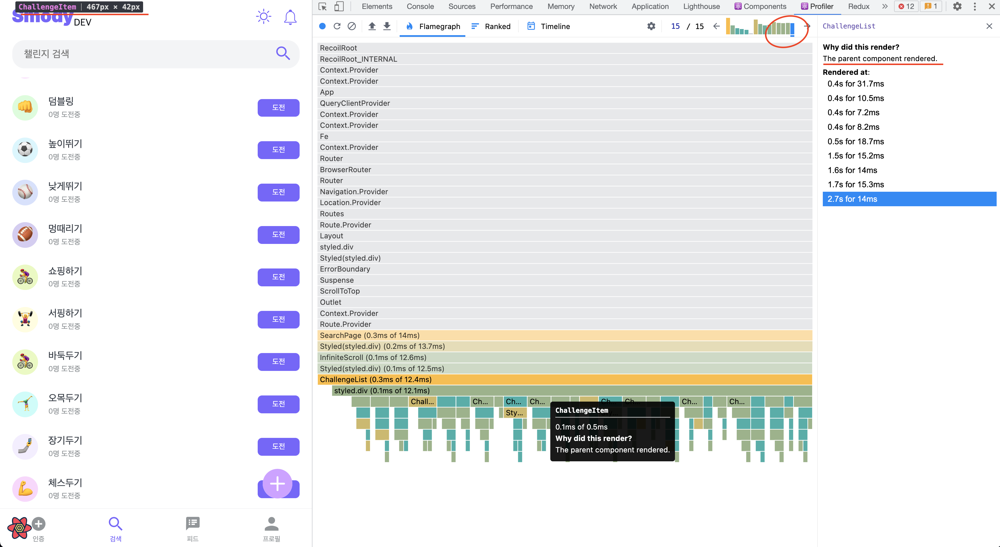
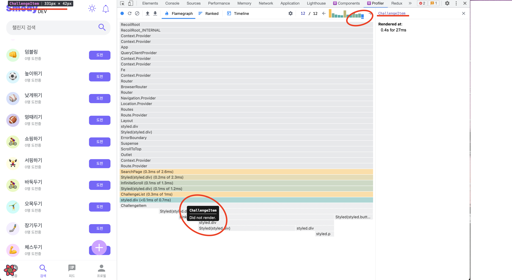

import { MDXImageWrapper } from 'components';

# CSS 측면의 최적화

브라우저의 렌더링 과정 중 Reflow와 Repaint 과정이 오래 걸린다. 따라서 렌더링을 최적화하기 위해서 해당 렌더링 과정의 발생을 줄이는 것이 중요하다.

 

예를들어 애니메이션을 구현할 때 `top`, `left` 등의 속성을 이용하는 것보다, reflowf를 발생하지 않은 `transform` 속성을 이용하는 것이 렌더링 최적화 측면에서 적합하다.

 

💡 성능이 낮은 애니메이션은 Frame Drop을 발생시킬 수 있다. Frame Drop이 발생하면 사용자가 화면 버벅임을 느낄 수 있고, 때문에 사용자 경험을 해칠 수 있다.

💡 추가로 애니메이션을 구현할 때, `transform` 속성을 이용하면 [Layout Shift](https://web.dev/cls/) 현상을 예방할 수 있다.

 

# React 측면의 성능 최적화
## React.memo()

React에서 컴포넌트의 렌덜이 조건 중 `부모 컴포넌트의 리렌더링` 조건이 있다. 해당 조건에 의해 자식 컴포넌트의 prop에 변화가 없더라도 부모 컴포넌트가 리렌더링되면 자식 컴포넌트 역시 리렌더링 된다.

 

`React.memo()`를 사용하면 위와 같은 상황에서 컴포넌트가 불필요하게 렌더링되는 현상을 막을 수 있다.

 

## 비제어 컴포넌트 사용

input 요소가 있는 페이지에서 페이지의 리렌더링 횟수를 줄이기 위해 비제어 컴포넌트를 도입하는 것도 하나의 방법이다.

 

비제어 컴포넌트에 대해서는 [해당 페이지](../React%205c8f7f5ce8a54b0e8c2ddf8a0b65f205/Controlled%20Component%E1%84%8B%E1%85%AA%20Uncontrolled%20Component%20bfdb3ad13ae346fc916fd7aaee1bd303.md)에 정리를 했다.

 

## 성능 측정 방법

React의 렌더링 성능을 측정하기 위해서는 [React Developer Tools](https://chrome.google.com/webstore/detail/react-developer-tools/fmkadmapgofadopljbjfkapdkoienihi)플러그인을 사용할 수 있다. 해당 플러그인을 이용하면 컴포넌트의 렌더링 횟수와 리렌더링 여부를 확인할 수 있다.

 

아래의 이미지는 렌더링 최적화의 전, 후를 React Developer Tools로 측정한 결과이다.

 

**성능 최적화 전**

<MDXImageWrapper style={{ maxWidth: '100%' }} caption="마지막 커밋 단계에서도 이전 페이지의 ChallengeItem이 렌더링 됨">
  
</MDXImageWrapper>

 

**성능 최적화 후**

<MDXImageWrapper style={{ maxWidth: '100%' }} caption="마지막 커밋 단계에서 이전 페이지의 ChallengeItem이 렌더링 안됨">
  
</MDXImageWrapper>

 

React Developer Tools 자세한 사용법은 아래의 React Blog 게시글에서 확인할 수 있다.

 

### 참고 자료
[Introducing the React Profiler - React Blog](https://reactjs.org/blog/2018/09/10/introducing-the-react-profiler.html#reading-performance-data)

 

# 참고 자료

[React.memo() 현명하게 사용하기](https://ui.toast.com/weekly-pick/ko_20190731)

[누적 레이아웃 이동 최적화](https://web.dev/i18n/ko/optimize-cls/#%EC%95%A0%EB%8B%88%EB%A9%94%EC%9D%B4%EC%85%98-%F0%9F%8F%83%E2%80%8D%E2%99%80%EF%B8%8F)

[CSS 애니메이션 성능 개선 방법(reflow 최소화, will-change 사용) | WIT블로그](https://wit.nts-corp.com/2017/06/05/4571)

[How to create high-performance CSS animations](https://web.dev/animations-guide/)

[Why are some animations slow?](https://web.dev/animations-overview/)
