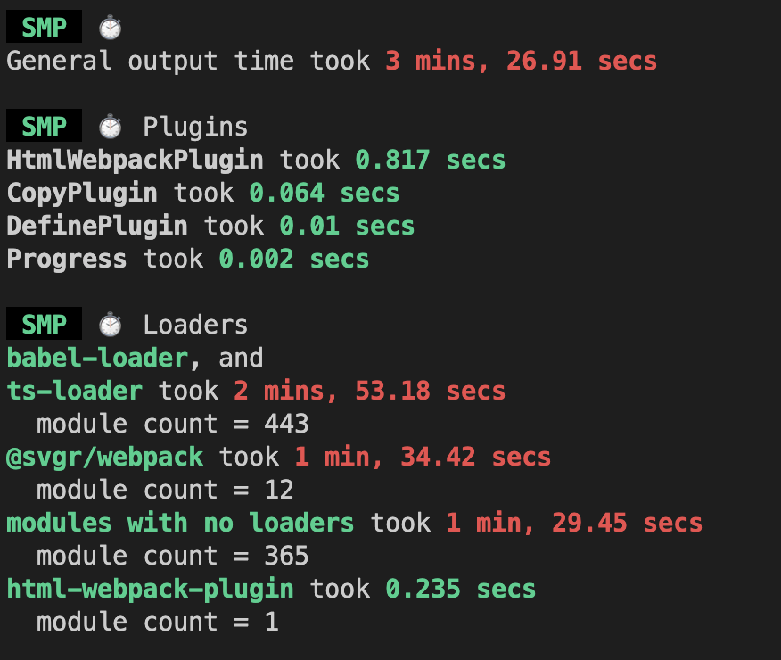
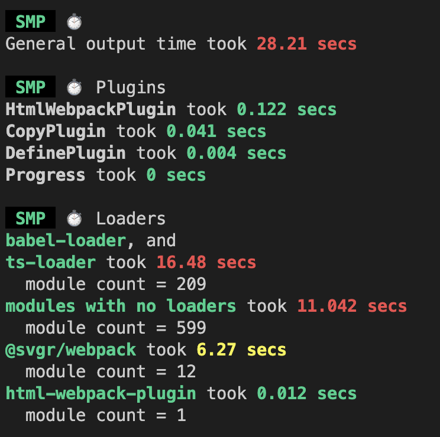
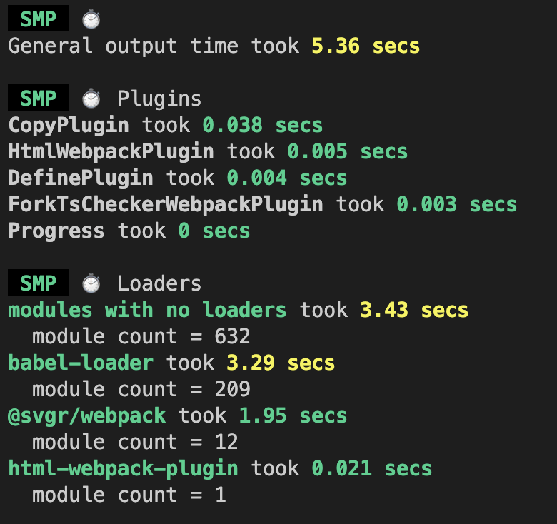
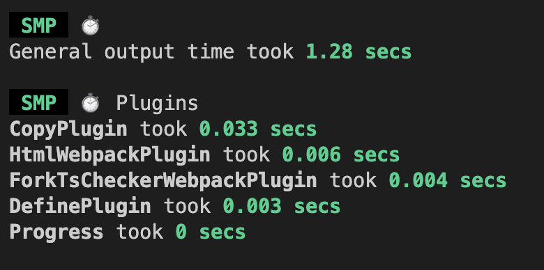

# 초기 상태

webpack 설정을 처음 할 때, ts(또는 tsx) 파일의 처리하는 설정을 잘못했다.

때문에 빌드 속도가 약 30초 정도로 오래 걸렸다.

<br/>

당시 설정은 다음과 같았다.

```jsx
{
  test: /\.(js|jsx|ts|tsx)$/i,
  use: ['babel-loader', 'ts-loader'],
},
```

<br/>

해당 설정에서 문제가 되는 부분은 다음과 같다.

- exclude 옵션이 없다.
- babel-loader와 ts-loader를 함께 사용했다.

<br/>

해당 설정을 동일하게 한 후 현재 다시 빌드를 해보면 **약 200초**가 소요된다.

<div style={{ maxWidth: '450px', margin: '0 auto', borderRadius: '5px', overflow: 'hidden' }}>
  
  <figcaption style={{ margin: '5px 0', color: '#AEAEAE', fontSize: '0.9rem', textAlign: 'center' }}>빌드 속도 최적화 전</figcaption>
</div>

<br/>

이번 글에서는 빌드 속도를 개선한 경험에 대해 정리하려한다. 추가로 development와 production에서 적용한 설정에 대해 정리하려 한다.

# exclude 옵션 설정

exclude 옵션을 사용해서 node_modules에 있는 모듈은 처리하지 않도록 설정했다.

```jsx
{
  test: /\.(js|jsx|ts|tsx)$/i,
  exclude: /node_modules/,
  use: ['babel-loader', 'ts-loader'],
},
```

<br/>

그 결과 빌드 속도가 약 200초에서 **약 28**초로 감소했다.

<div style={{ maxWidth: '450px', margin: '0 auto', borderRadius: '5px', overflow: 'hidden' }}>
  
  <figcaption style={{ margin: '5px 0', color: '#AEAEAE', fontSize: '0.9rem', textAlign: 'center' }}>exclude 옵션 적용 후</figcaption>
</div>

<br/>

# 각 loader의 빌드 속도 비교

babel-loader와 ts-loader 모두 ts 파일을 transpiling 해준다. 따라서 하나의 loader만 사용해도 된다.

<br/>

다만 차이점은 babel-loader의 경우 type-checking 기능이 없다는 것이다.

따라서 babel-loader의 경우 type-checking을 위해서 ****[fork-ts-checker-webpack-plugin](https://www.npmjs.com/package/fork-ts-checker-webpack-plugin)**** 플러그인이 추가로 필요하다. 

<br/>

추가로 esbuild-loader도 있다. 이 로더의 경우 type-checking을 하지 않지만 go언어로 동작하기 때문에 속도가 매우 빠르다고 한다.

<br/>

위 세 가지 로더를 각각 사용해서 빌드 시간을 비교했다.

||babel-loader|ts-loader|esbuild-loader|
|---|---|---|---|
|빌드 시간|19초|17초|14초|

<br/>

💡세 가지 로더 모두  [fork-ts-checker-webpack-plugin](https://www.npmjs.com/package/fork-ts-checker-webpack-plugin)을 적용했다.

- 해당 플러그인은 type-checking을 가능하게 해준다.
- ts-loader와 함께 사용하면 빌드와 type-checking을 병렬로 수행해 빌드 속도가 개선되는 효과가 있다.

<br/>

비교 결과 esbuild-loader를 이용할 때 가장 빠르게 빌드됐다.

# loader 선택

그렇다면 가장 빠른 esbuild-loader를 선택했는가? 그건 아니다. **loader는 babel-loader를 선택했다.**

그 이유는 다음과 같다.

<br/>

1. 크로스 브라우징 문제
    
    다른 로더와 다르게 babel-loader의 특징은 polyfill을 주입할 수 있다는 것이다. 따라서 단순히 transpiling만 해주는 나머지 두 loader에 비해 크로스 브라우징 문제에 더 잘 대응할 수 있다.
  
    실제로 배포한 프로젝트가 구형 ios 기기에서 동작하지 않는 것을 통해 크로스 브라우징 문제를 직접 경험했다. 따라서 서비스 지원 범위를 넓히기 위해 traspiling되는 target 옵션을 낮췄다. 추가로 polyfill를 주입할 수 있는 babel-loader를 선택했다
    
2. 다양한 플러그인 지원
    
    babel을 이용하면 다양한 플러그인을 사용할 수 있다. 
    
    <br/>

    프로젝트에 추가로 설정한 플러그인은 babel-[plugin-styled-components](https://github.com/styled-components/babel-plugin-styled-components)이다. 해당 플러그인은 class 이름에 컴포넌트 이름을 주입하거나 styled-components 코드를 minify하는 등 styled-components를 이용할 때 편리한 기능을 제공한다.
    
    <br/>
    
    이처럼 babel을 이용하면 플러그인을 통해 추가 설정의 자유도가 높기 때문에 babel-loader를 선택했다.
    

<br/>

# Webpack Cache를 통한 빌드 속도 개선

webpack의 development 모드에서는 기본으로 [cache 옵션](https://webpack.kr/configuration/cache/)에 `type: ‘memory’`가 적용된다. 해당 옵션의 덕분에 재빌드의 속도가 초기 빌드의 속도보다 빠르다.


<br/>

cache 옵션에 `type: fileSystem`으로 설정하면 초기 빌드 속도도 높일 수 있다. fileSystem으로 옵션을 설정하면 웹팩의 모듈 및 청크를 fileSystem에 저장한다. 따라서 이미 캐싱된 데이터가 있다면 빌드할 때도 재빌드를 할 때처럼 빌드 속도를 개선할 수 있다.

- webpack 캐시가 없을 때 빌드 속도

  <div style={{ maxWidth: '450px', margin: '0 auto', borderRadius: '5px', overflow: 'hidden' }}>
    
    <figcaption style={{ margin: '5px 0', color: '#AEAEAE', fontSize: '0.9rem', textAlign: 'center' }}>webpack 캐시가 없을 때 빌드 속도</figcaption>
  </div>

- webpack 캐시가 있을 때 빌드 속도

  <div style={{ maxWidth: '450px', margin: '0 auto', borderRadius: '5px', overflow: 'hidden' }}>
    
    <figcaption style={{ margin: '5px 0', color: '#AEAEAE', fontSize: '0.9rem', textAlign: 'center' }}>webpack 캐시가 있을 때 빌드 속도</figcaption>
  </div>

<br/>

💡캐시된 데이터는 `node_modules/.cache/webpack` 에 저장된다.


<br/>

# 결론

초기에 잘못된 웹팩 설정 문제를 해결하여 빌드 속도를 200초에서 19초까지 개선했다.

또한 development환경에서는 Webpack cache 옵션을 `type: fileSystem` 으로 설정하여 빌드 결과의 캐싱을 적극적으로 활용하였다. 덕분에 캐싱 데이터가 있다면, 빌드 속도가 5초에서 1초까지 개선되는 효과를 냈다.
