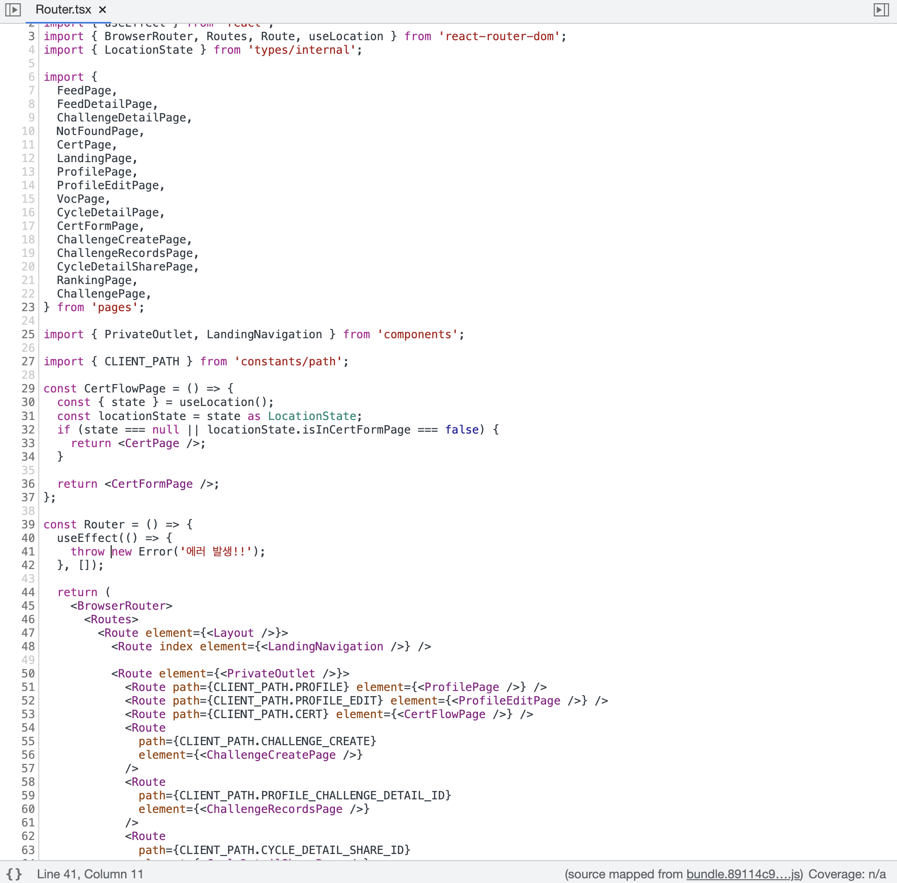
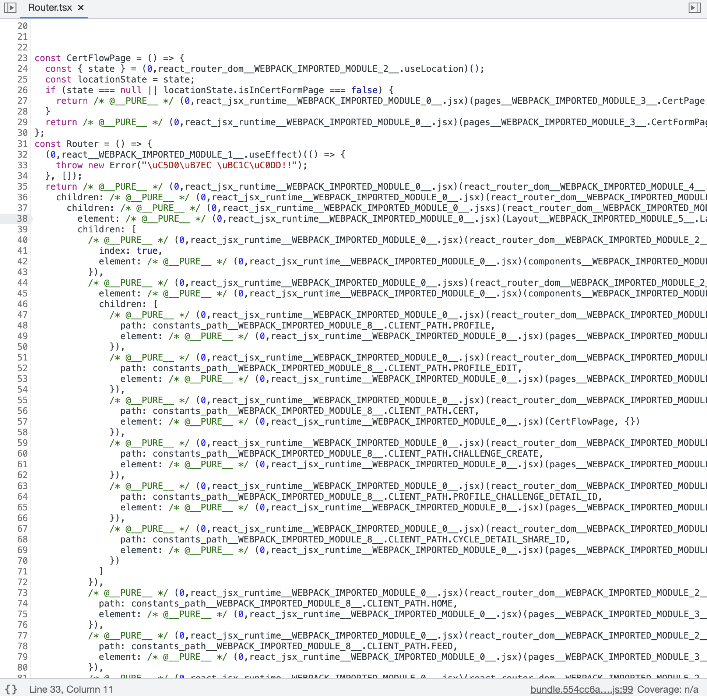
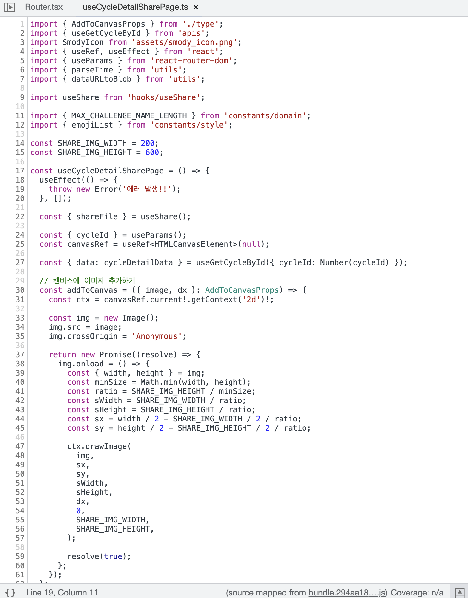
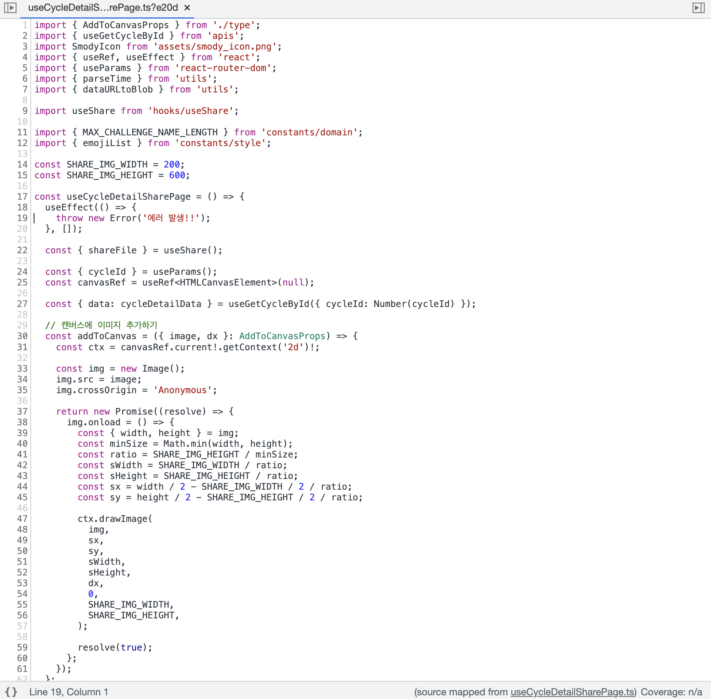

import { MDXImageWrapper, ToggleList } from 'components';

# 들어가며

프로젝트 빌드 환경을 직접 구축하기 위해 여러 옵션을 공부하고 적용했다. 이번 글에서는 스모디 프로젝트에 사용된 webpack 빌드 옵션을 정리하려 한다.

<br/>

# Webpack 환경 설정

스모디 4.2.1 버전 기준 webpack 설정은 다음과 같다.

<ToggleList summary="webpack.config.js">
  ```jsx
    const webpack = require('webpack');
    const HtmlWebpackPlugin = require('html-webpack-plugin');
    const CopyWebpackPlugin = require('copy-webpack-plugin');
    const path = require('path');
    const isProd = process.env.NODE_ENV === 'production';
    const isLocal = process.env.NODE_ENV === 'local';
    const dotenv = require('dotenv');
    const { ESBuildMinifyPlugin } = require('esbuild-loader');
    
    dotenv.config({ path: '.env' });
    
    module.exports = {
      mode: isProd ? 'production' : 'development',
      devtool: isProd ? false : 'eval',
      performance: {
        hints: false,
      },
      entry: './src/index.tsx',
      output: {
        publicPath: '/',
        path: path.join(__dirname, '/dist'),
        filename: 'bundle.[chunkhash].js',
        clean: true,
      },
      resolve: {
        extensions: ['.js', '.jsx', '.ts', '.tsx'],
        modules: [path.resolve(__dirname, 'src'), 'node_modules'], // node_modules/보다 우선으로 검색할 디렉터리를 추가하는 것은 다음과 같습니다.
      },
      module: {
        rules: [
          {
            test: /\.(js|jsx|ts|tsx)$/i,
            exclude: /node_modules/,
            loader: 'esbuild-loader',
            options: {
              loader: 'tsx',
              target: 'es2020',
            },
          },
          {
            test: /\.(png|webp)$/,
            type: 'asset',
            generator: {
              filename: 'assets/[name][hash][ext]',
            },
          },
          // CRA에서는 svg를 자동으로 처리해주지만, CRA를 사용하지 않은 경우 webpack config를 통한 사용 설정이 필요하다.
          {
            test: /\.svg$/,
            use: ['@svgr/webpack'],
          },
        ],
      },
      devServer: {
        historyApiFallback: true,
        port: 3000,
        hot: true,
        open: true,
      },
      optimization: {
        splitChunks: {
          chunks: 'all',
        },
        minimizer: [
          '...',
          new ESBuildMinifyPlugin({
            target: 'es2020'
          }),
        ],
      },
      plugins: [
        new webpack.ProvidePlugin({
          React: 'react',
        }),
        new HtmlWebpackPlugin({
          template: './public/index.html',
        }),
        new webpack.HotModuleReplacementPlugin(),
        new webpack.DefinePlugin({
          'process.env.BASE_URL': JSON.stringify(
            isProd ? process.env.PROD_BASE_URL : process.env.DEV_BASE_URL,
          ),
          'process.env.CLIENT_ID': isProd ? undefined : JSON.stringify(process.env.CLIENT_ID),
          'process.env.PUBLIC_KEY': isProd
            ? undefined
            : JSON.stringify(process.env.PUBLIC_KEY),
          'process.env.IS_LOCAL': JSON.stringify(isLocal),
        }),
        new CopyWebpackPlugin({
          patterns: [
            { from: 'public/image', to: 'image' },
            { from: 'public/manifest.json', to: '.' },
            { from: 'public/pwaServiceWorker.js', to: '.' },
          ],
        }),
      ],
    };
  ```
</ToggleList>

<br/>

# devtool은 왜 이렇게 설정했는가?

```jsx
devtool: isProd ? false : 'eval-cheap-module-source-map',
```

<br/>

개발모드에서 원활한 디버깅을 위해 소스맵을 사용하기로 결정했다.

💡 소스 맵(Source Map)이란 배포용으로 빌드한 파일과 원본 파일을 서로 연결시켜주는 기능이다.

webpack을 사용해 번들링한 코드로부터 소스 코드를 유추하는건 너무나 비효율적이기 때문에 개발하는 코드와 번들링된 코드를 연결하는 Source Map을 사용한다.

<br/>

**source-map 있는 경우**

<MDXImageWrapper caption="source-map 있는 경우 코드">
  
</MDXImageWrapper>

<br/>

**source-map 없는 경우**

<MDXImageWrapper caption="source-map 없는 경우 코드">
  
</MDXImageWrapper>

<br/>

여러 소스맵 옵션 중 **eval-cheap-module-source-map**을 사용하기로 결정했다. 해당 옵션은 아래의 조건을 만족하기 때문이다.

1. 디버깅을 할 때 코드의 라인을 보존해야 에러 위치를 빠르게 파악할 수 있다.
2. 빌드와 리빌드 속도가 빨라야한다.

<br/>

코드 품질자체는 유의미한 차이가 나지 않았다.

하지만 eval-cheap-module-source-map이 더 빌드가 빠르게 되고

이는 개발 중 일어나는 많은 빌드와 하드웨어 상태에 따라 유의미한 차이를 이끌어 낼 것 같아서 다음의 옵션으로 선택했다.

<br/>

**source-map 사용 예시**

<MDXImageWrapper caption="source-map 사용 예시">
  
</MDXImageWrapper>

<br/>

**eval-cheap-module-source-map 사용 예시**

<MDXImageWrapper caption="eval-cheap-module-source-map 사용 예시">
  
</MDXImageWrapper>

<br/>

**참고 자료**

[https://webpack.kr/configuration/devtool/](https://webpack.kr/configuration/devtool/)

<br/>

# ouput은 왜 이렇게 설정했는가?

```jsx
output: {
  ...
	publicPath: '/',
  filename: 'bundle.[chunkhash].js',
  ...
},
```

## publicPath

publicPath는 실제 브라우저에서 빌드된 파일에 접근하기 위한 path이다. 따라서 `/`만을 지정해서 server의 host 주소만 입력해도 번들된 디렉터리의 index.html에 접근할 수 있도록 했다.

<br/>

## filename의 hash값

filename의 경우 chunkHash를 사용해서 hash 값을 생성했다. hash 값의 경우 캐시 버스팅(cach bursting)효과를 위해 사용했다.

<br/>

### contentHash 대신 chunkHash를 사용한 이유

contentHash 대신 chunkHash를 사용한 이유는 프로젝트에서 styeld-componetns을 사용하기 때문이다. stsyled-componetns는 CSS in JS  방식이다. 따라서 CSS 파일이 생성되지 않는다. 때문에 스타일과 관련 없는 JS 코드만 변경했을 때 기존의 css 파일의 해시 값이 유지되던 contentHash의 이점이 적용되지 않는다. 이런 이유로 contentHash 대신 chunkHash를 사용했다.

<br/>

**참고 자료**

[https://webpack.kr/configuration/output/](https://webpack.kr/configuration/output/)

[https://stackoverflow.com/a/59197260](https://stackoverflow.com/a/59197260)

<br/>

# resolve는 왜 이렇게 설정했는가?

```jsx
resolve: {
  extensions: ['.js', '.jsx', '.ts', '.tsx'],
  modules: [path.resolve(__dirname, 'src'), 'node_modules'], // node_modules/보다 우선으로 검색할 디렉터리를 추가하는 것은 다음과 같습니다.
}
```

<br/>

## extensions

extensions 옵션에 확장자 목록을 설정할 수 있다. 설정된 확장자에 해당되는 파일들은 import 할 때 파일 확장자를 명시하지 않아도된다. 이와 같은 편리함 때문에 extensions 옵션을 설정했다.

<br/>

## modules

modules 옵션은 모듈을 검색할 디렉터리 목록을 설정하는 옵션이다. 목록의 앞에 있는 경로부터 모듈을 탐색한다. node_modules 보다 src를 먼저 탐색하기 위해 src를 배열의 첫 번째 요소로 지정했다.

<br/>

**참고 자료**

[https://webpack.kr/configuration/resolve/](https://webpack.kr/configuration/resolve/)

<br/>

# module의 rules는 왜 이렇게 설정했는가?

## ts 및 tsx 처리 방법

```jsx
{
  test: /\.(js|jsx|ts|tsx)$/i,
  exclude: /node_modules/,
  loader: 'esbuild-loader',
  options: {
    loader: 'tsx',
    target: 'es2020',
  },
},
```

### 참고 자료

[babel-loader와 ts-loader 그리고 esbuild-loader](babel-loader%E1%84%8B%E1%85%AA%20ts-loader%20%E1%84%80%E1%85%B3%E1%84%85%E1%85%B5%E1%84%80%E1%85%A9%20esbuild-loader%20429b4e709cc24529a87254645a0d2d5a.md)

<br/>

## png 및 webp 처리 방법

```jsx
{
  test: /\.(png|webp)$/,
  type: 'asset',
  generator: {
    filename: 'assets/[name][hash][ext]',
  },
},
```

webpack5 이후부터는 별도의 loader 없이 asset 파일(fonts, icons, etc)을 사용할 수 있다.

<br/>

webpack 5 이후 도입된 `Asset Modules` 타입은 4개의 새 모듈 타입들이 있다.

- `asset/source` : asset의 소스코드를 export한다. `raw-loader` 를 대체한다.
- `asset/inline` : asset의 data URI를 export한다. `url-loader` 를 대체한다.
- `asset/resource` : 각각의 파일을 emit하고 URL을 export한다. `file-loader` 를 대체한다.
- `asset` : data URI를 export할지 각각의 파일을 emit할 지 자동으로 선택한다. asset size limit이 있는 `url-loader` 를 대체한다.

<br/>

이미지를 불러오는 방법은 크게 두 가지 종류가 있다.

- 파일을 output 디렉터리에 파일을 emit하고 URL로 불러오는 방식
- data URL을 inline으로 사용하는 방식

<br/>

data URL의 경우 성능상 좋진않지만, 네트워크 요청의 수가 줄어든다는 단점이 있다. 따라서 크기가 작은 이미지의 경우 data URL을 사용하는 것도 좋은 선택일 수 있다.

<br/>

따라서 이미지 크기에 따라 두 방식을 적절하게 혼용해서 사용하기 위해 이미지 처리 방법을 Asset Modules의 type을 **asset**으로 결정했다.

<br/>

**참고자료**

[https://webpack.js.org/guides/asset-modules/](https://webpack.js.org/guides/asset-modules/)

<br/>

## svg 파일 처리 방법

```jsx
{
  test: /\.svg$/,
  use: ['@svgr/webpack'],
},
```

프로젝트 안에서 svg 이미지를 많이 사용한다. `@svgr/webpack` 은 svg 이미지를 import한 후 React 컴포넌트처럼 사용할 수 있게 해준다. 따라서 편리하게 svg 이미지를 사용하기 위해 해당 로더를 사용했다.

<br/>

**참고자료**

[https://react-svgr.com/docs/webpack/](https://react-svgr.com/docs/webpack/)

<br/>

# devServer는 왜 이렇게 설정했는가?

```jsx
devServer: {
  historyApiFallback: true,
  port: 3000,
  hot: true,
  open: true,
},
```

<br/>

### historyApiFallback

React Router DOM 내부적으로 HTML HistoryAPI가 사용되고 있다

HTML HistoryAPI를 사용할 때, index.html 페이지는 404 응답 대신 제공되어야함으로 true로 설정하여 새로고침해도 기존 페이지가 나오도록 설정하였다.

<br/>

**참고자료**

[https://webpack.kr/configuration/dev-server/#devserverhistoryapifallback](https://webpack.kr/configuration/dev-server/#devserverhistoryapifallback)

[https://basemenks.tistory.com/270](https://basemenks.tistory.com/270)

<br/>

# optimization은 왜 이렇게 설정했는가?

```jsx
optimization: {
    splitChunks: {
      chunks: 'all',
    },
    minimizer: [
      '...',
      new ESBuildMinifyPlugin({
        target: 'es2020',
        css: true,
      }),
    ],
  },
```

## splitChunks

### chunk란?

yceffort님에 의하면 chunk는 다음과 같다.

> ***웹팩에서, 애플리케이션 코드를 각각 다른 파일로 나눈것을 `chunk`라고 부른다***
> 

<br/>

### splitChunks.chunks를 사용하면 어떤 효과가 있는가?

splitChunks.chunks를 사용하면 chunks 간에 공통으로 사용되는 코드를 추출해서 새로운 chunk로 만든다.

따라서 빌드된 파일의 용량을 감소시키는 효과가 있다.

<br/>

실제로 splitChunks.chunks 옵션의 적용 전후 비교한 결과는 다음과 같다.

<br/>

**splitChunks.chunks 적용 전**

총 chunk 용량: 353.34KB

총 chunk 개수: 25개

<MDXImageWrapper caption="splitChunk 적용 전 gzip">
  
</MDXImageWrapper>

<br/>

**splitChunks.chunks 적용 후**

총 chunk 용량: 352.33KB

총 chunk 개수: 26개

<MDXImageWrapper caption="splitChunk 적용 후 gzip">
  
</MDXImageWrapper>

<br/>

효과가 크진 않지만, 용량 감소가 있는 것이 확인돼서 해당 옵션을 사용하기로 했다.

또한 webpack 공식 문서에 의하면 splitChunks.all 옵션을 사용하는 것이 권장된다.

> Providing `all` can be particularly powerful, because it means that chunks can be shared even between async and non-async chunks.
> 

<br/>

따라서 splitChunks.chunks 옵션을 all로 지정했다.

<br/>

**참고자료**

[https://webpack.js.org/plugins/split-chunks-plugin/#splitchunkschunks](https://webpack.js.org/plugins/split-chunks-plugin/#splitchunkschunks)

[https://yceffort.kr/2020/07/make-use-of-long-term-caching](https://yceffort.kr/2020/07/make-use-of-long-term-caching)

[https://hoilzz.github.io/webpack/6-code-split/](https://hoilzz.github.io/webpack/6-code-split/)

[https://helloinyong.tistory.com/307](https://helloinyong.tistory.com/307)

<br/>

## minimizer

```jsx
 minimizer: [
  '...',
  new ESBuildMinifyPlugin({
    target: 'es2020',
  }),
],
```

<br/>

minimizer 속성으로 최적화할 때 적용되는 plugin을 재정의 할 때, `‘…’`을 같이 사용하면 기존에 default로 적용되던 plugin도 같이 적용할 수 있다. 기본으로 적용되는 최적화 plugin을 함께 적용하기 위해 `‘…’` 사용했다.

<br/>

esbuild-loader를 사용하기 때문에 로더에 맞는 최적화 플러그인인 ESBuildMinifyPlugin을 사용했다.

같은 이치로 target 또한 esbuild-loader와 같게 설정했다.(일단 보류, 이 플러그인 사용하던 안하던 번들 크기에 아무런 영향을 주지 않는다.)

<br/>

**참고 자료**

[https://webpack.kr/configuration/optimization/#optimizationminimizer](https://webpack.kr/configuration/optimization/#optimizationminimizer)

<br/>

# plugins는 왜 이렇게 설정했는가?

```jsx
plugins: [
  new webpack.ProvidePlugin({
    React: 'react',
  }),
  new HtmlWebpackPlugin({
    template: './public/index.html',
  }),
  new webpack.HotModuleReplacementPlugin(),
  new webpack.DefinePlugin({
    'process.env.BASE_URL': JSON.stringify(
      isProd ? process.env.PROD_BASE_URL : process.env.DEV_BASE_URL,
    ),
    'process.env.CLIENT_ID': isProd ? undefined : JSON.stringify(process.env.CLIENT_ID),
    'process.env.PUBLIC_KEY': isProd
      ? undefined
      : JSON.stringify(process.env.PUBLIC_KEY),
    'process.env.IS_LOCAL': JSON.stringify(isLocal),
  }),
  new CopyWebpackPlugin({
    patterns: [
      { from: 'public/image', to: 'image' },
      { from: 'public/manifest.json', to: '.' },
      { from: 'public/pwaServiceWorker.js', to: '.' },
    ],
  }),
  new BundleAnalyzerPlugin(),
],
```

<br/>

## webpack.ProvidePlugin

불필요한 플러그인이라 삭제! 해당 플러그인은 자동으로 모듈을 import 해주는 코드를 삽입해준다.

<br/>

**참고 자료**

[https://velog.io/@arara90/webpack-3.-플러그인Plugin-사용하기#provideplugin](https://velog.io/@arara90/webpack-3.-%ED%94%8C%EB%9F%AC%EA%B7%B8%EC%9D%B8Plugin-%EC%82%AC%EC%9A%A9%ED%95%98%EA%B8%B0#provideplugin)

<br/>

## HtmlWebpackPlugin

번들 디렉터리에 HTML을 생성하는 플러그인이다. template 옵션을 사용해서 `public/index.html`을 템플릿으로 하여 번들된 결과에 index.html을 생성하였다.

<br/>

**참고 자료**

[https://yamoo9.gitbook.io/webpack/webpack/webpack-plugins/automatic-injection-to-html-document](https://yamoo9.gitbook.io/webpack/webpack/webpack-plugins/automatic-injection-to-html-document)

<br/>

## webpack.HotModuleReplacementPlugin

devserver의 hot 옵션이 있으면 해당 플러그인은 필요하지 않다. 따라서 해당 플러그인을 제거했다.

<br/>

**참고 자료**

[https://webpack.kr/configuration/dev-server/#devserverhot](https://webpack.kr/configuration/dev-server/#devserverhot)

<br/>

## webpack.DefinePlugin

코드에 전역 상수를 주입하는 플러그인이다. 코드 실행 환경에 대한 정보 또는 `.env` 파일에 있는 정보를 주입하기 위해 해당 플러그인을 사용했다.

<br/>

### EnvironmentPlugin 대신 DefinePlugin을 사용한 이유

EnvironmentPlugin을 사용하면 환경 변수에 대한 전역 상수를 주입 가능하다. 반면에, DefinePlugin은 환경 변수 뿐만 아니라 일반 전역 상수도 주입이 가능하다. 이런 범용적인 측면을 고려해서 DefinePlugin을 사용하게됐다.

<br/>

**참고 자료**

[https://www.daleseo.com/webpack-plugins-define-environment/](https://www.daleseo.com/webpack-plugins-define-environment/)

## CopyWebpackPlugin

특정 파일을 번들 폴더에 주입하기 위해 사용하는 플러그인이다. 현재 프로젝트에서는 이미지, mainfest.json, pwaServiceWorker 파일을 주입하고 있다.

<br/>

**참고 자료**

[https://webpack.js.org/plugins/copy-webpack-plugin/](https://webpack.js.org/plugins/copy-webpack-plugin/)