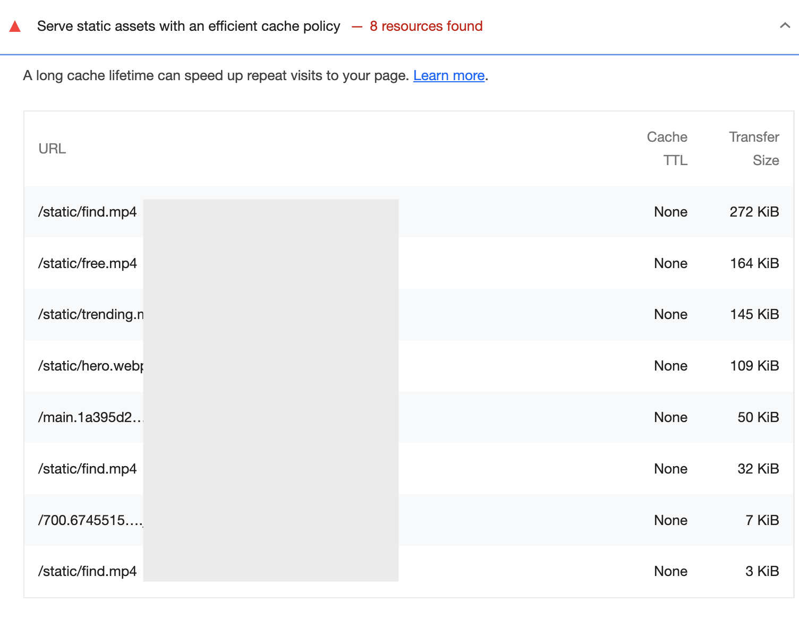
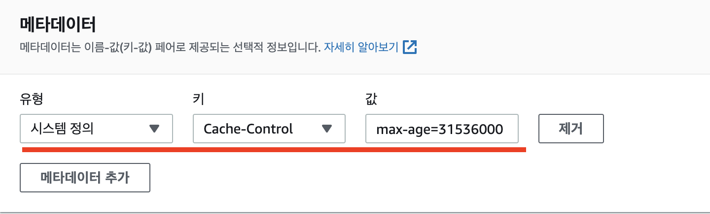
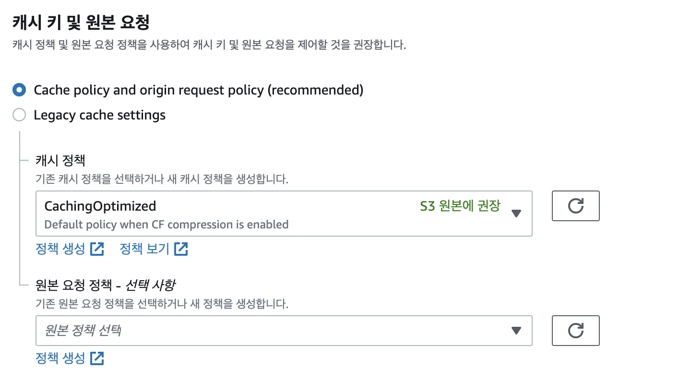
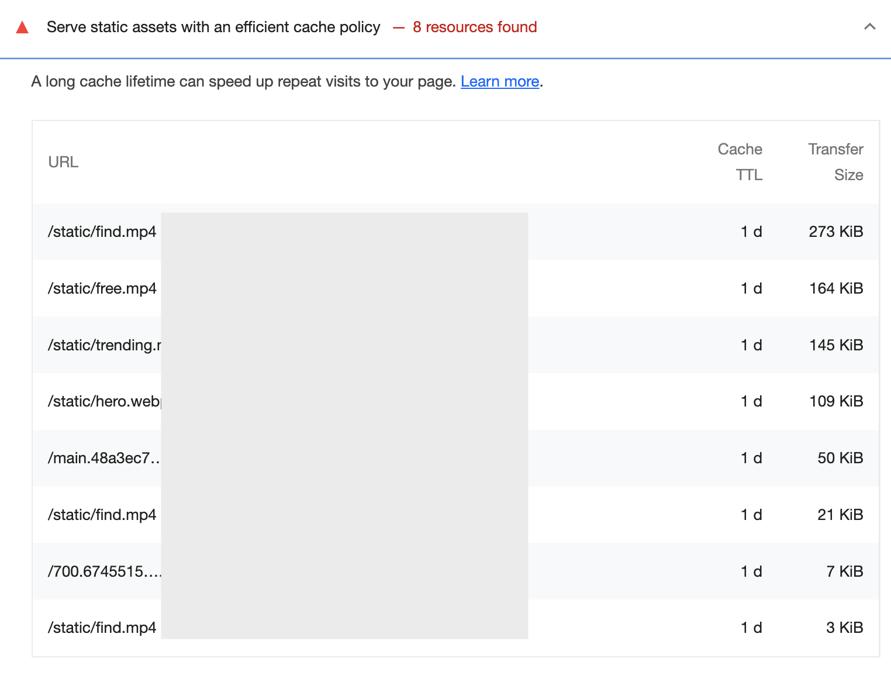

import { MDXImageWrapper, ToggleList } from 'components';

# 들어가며

성능 최적화 작업을 하면서 웹 캐시 문제를 마주했다. Lighthouse로 웹 성능을 측정한 결과 웹 캐시 관련돼서 개선할 것을 권고 받았다.

<MDXImageWrapper caption="Cache TTL 설정 안한 경우">
  
</MDXImageWrapper>

 

따라서 이번 글에서는 HTTP Cache에 대해서 알아보고, 현재 사용하고 있는 CloudFront에서 Cache를 설정하는 방법에 대해 정리하려 한다.

 

# HTTP Cache란?

> 웹 사이트와 애플리케이션의 성능은 이전에 가져온 리소스들을 재사용함으로써 현저하게 향상될 수 있습니다. 웹 캐시는 레이턴시와 네트워크 트래픽을 줄여줌으로써 리소스를 보여주는 데에 필요한 시간을 줄여줍니다.
> 

 

MDN 문서에 HTTP Cache에 대해 위와 같이 정의돼 있다. 캐시는 이미 한 번 요청한 데이터를 별도의 저장 공간에 저장해두고, 다음번에 동일한 데이터가 필요할 때 미리 저장한 데이터를 다시 활용하는 방법이다. 덕분에 클라이언트에서 서버로 요청하는 횟수를 줄일 수 있다.

 

 

# Cache 설정 방법

## Cache-Control 헤더

> `[Cache-Control](https://developer.mozilla.org/ko/docs/Web/HTTP/Headers/Cache-Control)` HTTP/1.1 기본 헤더 필드는 요청과 응답 양측 모두에 있어 캐싱 메커니즘을 위한 디렉티브를 지정하는데 사용됩니다.
> 

[MDN 문서](https://developer.mozilla.org/ko/docs/Web/HTTP/Caching#%EC%BA%90%EC%8B%B1_%EC%A0%9C%EC%96%B4)에 Cache-Control에 대해 위와 같이 정의돼 있다. 즉, HTTP 응답 헤더에 Cache-Control을 속성을 사용하면 서버에서 데이터를 반환할 때, 해당 데이터를 캐시에 저장하라고 브라우저에게 알려줄 수 있다.

 

Cache-Control 필드에 대한 자세한 값 설정은 Cache-Control에 대한 MDN 문서에서 확인 가능하다.

 

## S3와 CloudFront의 캐시 설정

Cache-Conrol는 응답 헤더에 설정하는 필드이다. 따라서 서버 측에서 데이터를 반환할 때, 헤더에 설정을 해야 한다. 만약, S3와 CloudFront 등 서버 리스 Cloud Service를 이용한다면, 각 서비스의 설정 페이지에서 캐시 설정을 진행해야 한다. 이에 대한 자세한 설명은 [Aws 공식 문서](https://docs.aws.amazon.com/ko_kr/AmazonCloudFront/latest/DeveloperGuide/Expiration.html)에 명시돼 있다. 

 

**S3의 각 객체에 캐시 설정**

S3에서 각 객체에 대해 Cache-Control을 설정할 수 있다. 설정하는 방법은 위 AWS 문서의 ****Amazon S3 콘솔을 사용하여 객체에 헤더 추가**** 섹션에 자세히 명시돼 있다.

 

객체의 Cache-Control 설정은 S3 버킷 페이지의 **객체 > 작업 > 메타데이터 편집 > 메타데이터 추가**에서 할 수 있다.

 

아래 이미지는 객체의 Cach-Conrol의 max-age를 1년(31536000초)으로 설정한 예시이다.

 

<MDXImageWrapper caption="S3 Cache-Control 설정">
  
</MDXImageWrapper>

 

💡참고로, [Web.dev의 문서](https://web.dev/i18n/ko/uses-long-cache-ttl/#http-%EC%BA%90%EC%8B%B1%EC%9D%84-%EC%82%AC%EC%9A%A9%ED%95%98%EC%97%AC-%EC%A0%95%EC%A0%81-%EB%A6%AC%EC%86%8C%EC%8A%A4%EB%A5%BC-%EC%BA%90%EC%8B%9C%ED%95%98%EB%8A%94-%EB%B0%A9%EB%B2%95)에서는 max-age를 1년 이상으로 설정할 것을 권장한다. 또한 캐시의 TTL이 길 경우에는 배포마다 파일의 최신화를 위해서 파일의 이름에 해시를 포함하도록 설정하는 게 권장된다. 

 

**CloudFront의 캐시 정책 설정**

CloudFront에서 캐시 정책을 설정해서 원본 서버로부터 컨텐츠를 요청하는 시점과 시기를 제어할수 있다.

 

CloudFront의 설정 페이지의 **동작 > 동작 편집 > 캐시 키 및 원본 요청**에서 캐시 정책을 설정할 수 있다.

 

<MDXImageWrapper caption="CloudFront 캐시 정책 설정">
  
</MDXImageWrapper>

 

정책 버튼을 눌러서 TTL 설정 섹션을 확인하면 최소 TTL, 최대 TTL, 기본 TTL을 확인할 수 있다.

각 TTL은 동작 방식은 [AWS 공식 문서](https://docs.aws.amazon.com/ko_kr/AmazonCloudFront/latest/DeveloperGuide/Expiration.html)의 **CloudFront에서 객체를 캐싱 하는 시간 지정** 섹션에 자세히 명시돼 있다.

 

# 끝으로

웹 캐시에 대한 설정을 적절하게 했다면, Lighthouse에서 cache와 관련된 경고 사항이 사라졌을 것이다.

만약 여전히 cache 관련된 경고가 보인다면 TTL을 늘리는 것을 권장한다. 아래의 예시처럼 TTL이 하루라면 여전히 Lighthouse에서 TTL을 증가시키는 것을 권장한다. 

 

<MDXImageWrapper caption="Cache TTL 짧은 경우">
  
</MDXImageWrapper>

 

이번 최적화 작업을 통해 HTTP Cache 개념에 대해 배울 수 있었다. 웹 서비스에 대한 최적화를 진행할 때 동일한 리소스를 여러 번 호출하지 않도록 신경 써야겠다는 사실도 알게 됐다.

 

# 참고자료

[HTTP caching - HTTP | MDN](https://developer.mozilla.org/ko/docs/Web/HTTP/Caching)

[구구 코치님의 HTTP 캐싱](https://www.youtube.com/watch?v=UxNz_08oS4E)

[효율적인 캐시 정책으로 정적 자산 제공](https://web.dev/i18n/ko/uses-long-cache-ttl/)

[콘텐츠가 캐시에 유지되는 기간(만료) 관리](https://docs.aws.amazon.com/ko_kr/AmazonCloudFront/latest/DeveloperGuide/Expiration.html)