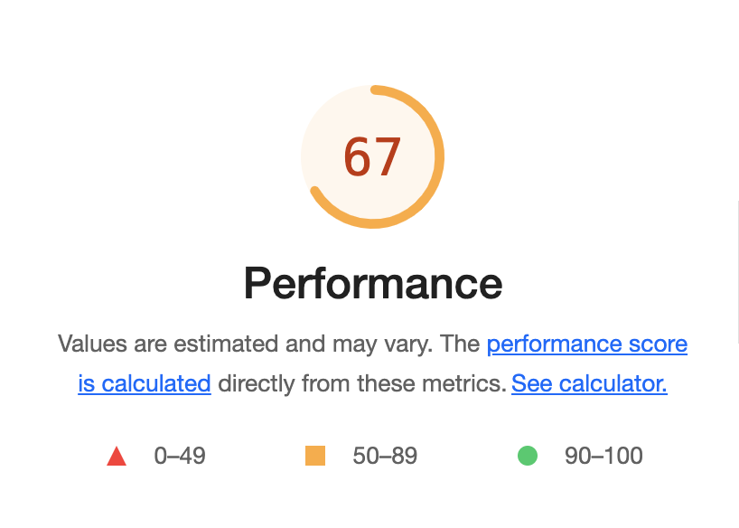
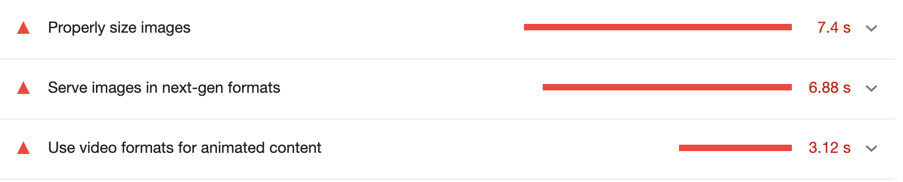
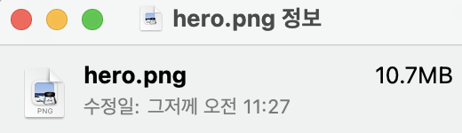
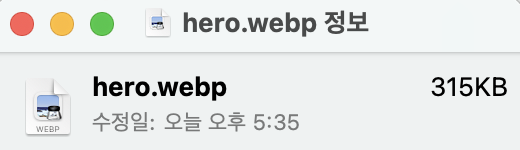
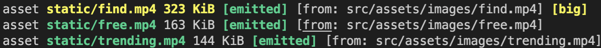
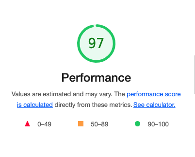

import { MDXImageWrapper, ToggleList } from 'components';

# 들어가며

최적화 작업을 하기 앞서 Lighthouse로 성능을 측정했다. 성능 점수는 아래와 같이 67점이 나왔다.

<br/>


<MDXImageWrapper caption="최적화 작업 전 Lighthouse 점수">
  
</MDXImageWrapper>

<br/>

주로 이미지나 gif 등 asset 부분에서 개선이 필요하다고 경고했다.

<MDXImageWrapper caption="성능상 문제점">
  
</MDXImageWrapper>

<br/>

개선이 필요한 항목과 상세 설명은 아래와 같다.

- Properly size images
    - Serve images that are appropriately-sized to save cellular data and improve load time. [Learn more](https://web.dev/uses-responsive-images/?utm_source=lighthouse&utm_medium=devtools).

<br/>

- Serve images in next-gen formats
    - Image formats like WebP and AVIF often provide better compression than PNG or JPEG, which means faster downloads and less data consumption. [Learn more](https://web.dev/uses-webp-images/?utm_source=lighthouse&utm_medium=devtools).

<br/>

- Use video formats for animated content
    - Large GIFs are inefficient for delivering animated content. Consider using MPEG4/WebM videos for animations and PNG/WebP for static images instead of GIF to save network bytes. [Learn more](https://web.dev/efficient-animated-content/?utm_source=lighthouse&utm_medium=devtools) LCP

<br/>

따라서 Lighthouse의 측정 결과 최적화를 하기 위해서 해야할 작업을 아래와 같다.

1. WebP 확장자로 이미지를 변환시키고 최적화 진행한다.
2. 이미지의 사이즈(width, height)를 수정한다.
3. Gif 파일의 확장자를 Mp4로 수정한다.

<br/>

이번 게시글에서는 3가지 작업을 통해 Lighthouse에서 성능 점수를 개선하는 과정을 기록하려 한다.

<br/>

# 1. 이미지의 확장자를 WebP로 수정한다.

## WebP란 무엇인가?

[위키 백과](https://ko.wikipedia.org/wiki/WebP)에서는 WebP에 대한 설명으로 아래와 같이 명시돼 있다.

> [2010년](https://ko.wikipedia.org/wiki/2010%EB%85%84) [9월 30일](https://ko.wikipedia.org/wiki/9%EC%9B%94_30%EC%9D%BC) [구글](https://ko.wikipedia.org/wiki/%EA%B5%AC%EA%B8%80)이 공개한 이미지 포맷으로, 사양 발표 시 각종 도구와 함께 제공되었다. 인터넷 웹페이지에서 널리 사용되고 있는 [JPEG](https://ko.wikipedia.org/wiki/JPEG)(제이펙)을 대체하기 위해 제시된 규격이다. 웹사이트의 [트래픽](https://ko.wikipedia.org/wiki/%ED%8A%B8%EB%9E%98%ED%94%BD) 감소 및 로딩 시간 단축을 겨냥한 것으로, 주로 사진 이미지 압축 효과가 높은 것으로 알려졌다.
> 

<br/>

즉, WebP는 웹 사이트의 트래픽 감소 및 로딩 시간 단축을 목표로 만들어진 이미지 포맷이다.

<br/>

## WebP 확장자로 이미지를 변환시키고 최적화 진행한다.

이미지 확장자를 변환시키는 작업에는 두 가지 접근 방향이 있다고 생각한다.

1. 제공된 이미지의 확장자를 직접 변환하는 방법
2. 빌드 시 동적으로 확장자를 변환하는 방법

<br/>

정적인 이미지의 경우 1번 방법이 더욱 간단하다. 하지만, 이번 최적화 작업은 연습을 하는 의도도 있었기 때문에 2번 방향으로 작업을 진행했다.

<br/>

<br/>


### 제공된 이미지의 확장자를 직접 변환하는 방법

커맨드라인 퉅로 WebP 확장자로 이미지를 변환할 수 있다. WebP 이미지를 변환시키는 방법은 [Web.dev 문서](https://web.dev/codelab-serve-images-webp/)에 상세하게 안내되어 있다. 이미지를 변환하는 명령어의 예시는 아래와 같다.

```bash
cwebp -q 50 images/flower1.jpg -o images/flower1.webp
```

cwebp를 사용하면 확장자 변환과 동시에 이미지의 품질 조절할 수 있어, 이미지 용량의 최적화가 가능하다.

<br/>

<br/>


### 빌드 시 동적으로 확장자를 변환하는 방법

Webpack으로 빌드 시 이미지 확장자를 변환하기 위해서 [ImageMinimizerWebpackPlugin](https://webpack.js.org/plugins/image-minimizer-webpack-plugin/)를 사용했다. 플러그인에서 사용하는 도구로 [imagemin](https://github.com/imagemin/imagemin)을 사용했다. 옵션으로 imagemin에 대한 조금 더 자세한 설명은 [Web.dev 문서](https://web.dev/i18n/ko/use-imagemin-to-compress-images/)에도 명시돼 있다. 

<br/>

webp 확장자로 이미지 변환을 위해 `imagemin의 generator`와 `imagemin-webp` 플러그인을 사용했다. imagemin-webp 플러그인을 사용하면 확장자 변환과 동시에 이미지의 품질을 조절할 수 있다. Webpack 설정 방법은 아래와 같다.

```jsx
// webpack.config.js
const ImageMinimizerPlugin = require('image-minimizer-webpack-plugin');

module.exports = {
	...
  optimization: {
    minimize: true,
    minimizer: [
      '...',
			new ImageMinimizerPlugin({
        deleteOriginalAssets: false,
        minimizer: {
          implementation: ImageMinimizerPlugin.imageminGenerate,
          options: {
            plugins: [['webp', { preset: 'photo', quality: 40 }]]
          }
        }
      })
    ]
  }
};
```

<br/>

이미지의 변환 결과는 아래와 같다. 왼쪽은 변환 전, 오른쪽은 변환 후 이미지의 확장자와 용량이다.

<br/>

<MDXImageWrapper caption="Webp 변환 전 이미지 크기">
  
</MDXImageWrapper>

<br/>

<MDXImageWrapper caption="Webp 변환 후 이미지 크기">
  
</MDXImageWrapper>

<br/>

결과적으로 약 10MB였던 png이미지가 315KB webp이미지로 변환되었다.

<br/>

<ToggleList summary="❗️webp 이미지를 지원하지 않은 브라우저에 대한 대처법">
  [can i use](https://caniuse.com/?search=webp)에서 webp를 확인하면 구형 브라우저의 경우 webp를 지원하지 않는 것을 확인할 수 있다.
    
  따라서 구형 브라우저를 이용하는 사용자를 고려해서 fallback 이미지를 사용할 필요가 있다.
  
  fallback 이미지는 [picture 태그](https://developer.mozilla.org/en-US/docs/Web/HTML/Element/picture)를 이용해서 제공할 수 있다.
  
  예시 코드는 다음과 같다.
  
  ```jsx
  import heroImageDesktop from '../../../../assets/images/hero_desktop.webp';
  import heroImageTablet from '../../../../assets/images/hero_tablet.webp';
  import heroImageMobile from '../../../../assets/images/hero_mobile.webp';
  import heroImagePng from '../../../../assets/images/hero.png';
  
  <picture>
    <source type="image/webp" media="(min-width: 1280px)" srcSet={heroImageDesktop} />
    <source type="image/webp" media="(min-width: 480px)" srcSet={heroImageTablet} />
    <source type="image/webp" media="(max-width: 479px)" srcSet={heroImageMobile} />
    </img>
  </picture>
  ```
  
  💡신형 브라우저에서도 webp 이미지의 렌더링을 차단할 수 있다. 해당 설정은 **크롬 기준으로 개발자 도구 > 렌더링 > Disable WebP image format** 을 통해 할 수 있다.
  
  💡picture 태그와 source 태그를 활용하면 화면 크기에 맞는 이미지를 적절하게 제공할 수 있다.
</ToggleList>
    
<br/>

# 2. 이미지의 사이즈를 수정한다.

최적화를 위해서 이미지의 사이즈도 조절할 필요가 있다. 현재 예시로 사용하는 이미지의 사이즈는 `4100 x 2735`인데, 이미지가 실제 렌더링 되는 영역의 크기는 `811 x 688`이다. 즉, 실제 렌더링 영역에 비해 이미지의 사이즈가 필요 이상으로 큰 상황이다. 따라서 이미지의 사이즈를 감소시켜 이미지의 용량을 최적화하려 한다.

<br/>

이미지의 사이즈 조절 작업은 1단계에서 사용했던 `imagemin-webp` 플러그인으로 수행했다. imagemin-webp 플러그인의 옵션으로 [resize 옵션](https://github.com/imagemin/imagemin-webp#resize)을 사용하면 이미지의 사이즈를 조절할 수 있다. 옵션 설정 예시는 아래와 같다.

```jsx
// webpack.config.js
const ImageMinimizerPlugin = require('image-minimizer-webpack-plugin');

module.exports = {
	...
  optimization: {
    minimize: true,
    minimizer: [
      '...',
			new ImageMinimizerPlugin({
        deleteOriginalAssets: false,
        minimizer: {
          implementation: ImageMinimizerPlugin.imageminGenerate,
          options: {
            plugins: [['webp', { preset: 'photo', quality: 40, resize: { width: 1920, height: 1280 }  }]]
          }
        }
      })
    ]
  }
};
```

<br/>

이미지 사이즈 조절 결과는 아래와 같다. 왼쪽이 이미지 사이즈 조절 전, 오른쪽이 이미지 사이즈 조절 후 결과이다.

<br/>

<MDXImageWrapper caption="이미지 사이즈 조절 전">
  
</MDXImageWrapper>

<br/>

<MDXImageWrapper caption="이미지 사이즈 조절 후">
  
</MDXImageWrapper>

<br/>

결과적으로 이미지의 사이즈가 `1920 x 1280` 으로 감소하였다. 또한 이미지의 용량이 315KB에서 111KB로 감소했다.

<ToggleList summary="이미지 사이즈 수동으로 변경하기">
  웹펙에서 빌드할 때 사용하는 플러그인 대신 [ImageMgick](https://imagemagick.org/index.php)으로 이미지의 크기도 변경이 가능하다.
    
  ImageMagick은 커맨드라인 툴이다. 해당 툴은 이미지 크기 변경 및 압축 기능도 제공하기 때문에 이미지를 변환하는 작업을 할때 유용하게 사용할 수 있다.
  
  **참고 자료**
  
  [compress jpeg images from terminal](https://apple.stackexchange.com/questions/283444/compress-jpeg-images-from-terminal)
  
  [ImageMagick](https://imagemagick.org/script/command-line-options.php#compress)
</ToggleList>

<br/>

# 3. Gif 파일의 확장자를 Mp4로 수정한다.

Lighthouse에서 애니메이션 컨텐츠의 확장자로 Gif 대신 video 관련 확장자를 사용하도록 권고했다.

권고에 대한 이유로 아래와 같이 명시돼 있다.

<br/>

> Large GIFs are inefficient for delivering animated content.
> 

크기가 큰 Gif의 파일의 경우 컨텐츠를 전송할 때 효율적이지 않다는 이유에서이다.

<br/>

그렇다면 Gif 파일의 크기를 최적화 시키면 가능하지 않을까? 라는 의문이 들었다. 따라서 Webpack으로 빌드할 때 Gif 파일을 최적화 시켜주는 플러그인을 사용해서 실험했다. 

<br/>

## Webpack으로 Gif 파일 최적화 하기

최적화를 위한 플러그인은 [imagemin-giflossy](https://www.npmjs.com/package/imagemin-giflossy)를 사용했다.최적화 설정은 아래와 같이 진행했다.

```jsx
// webpack.config.js
const ImageMinimizerPlugin = require('image-minimizer-webpack-plugin');

module.exports = {
	...
  optimization: {
    minimize: true,
    minimizer: [
      '...',
			new ImageMinimizerPlugin({
        deleteOriginalAssets: false,
        minimizer: {
          implementation: ImageMinimizerPlugin.imageminGenerate,
          options: {
						plugins: [
              ['giflossy', { optimizationLevel: 3, lossy: 200, colors: 64 }], // imagemin-giflossy 플러그인 적용
              ['webp', { preset: 'photo', quality: 40, resize: { width: 1920, height: 1280 } }]
            ]
          }
        }
      })
    ]
  }
};
```

<br/>

Gif 파일을 최적화한 결과 find.gif 파일의 크기가 `2MB`에서 `952KB`까지 용량이 감소한 것을 확인했다.

하지만 Webpack에서는 빌드 결과 asset의 크기가 크다고 경고했다.

<MDXImageWrapper caption="gif 파일 크기 문제">
  
</MDXImageWrapper>

<br/>

또한 Lighthouse에서도 여전히 비디오 format을 사용하도록 권장을 했다.

<MDXImageWrapper caption="gif 최적화 후 lighthouse 결과">
  
</MDXImageWrapper>

<br/>

따라서 Webpack으로 gif 파일을 최적화 방식보다는 직접 Gif 파일의 확장자를 변경하는 방향으로 최적화를 진행하기로 결정했다.

<br/>

## Gif 파일 확장자 변경하기

확장자 변경과 관련해서 [Web.dev](http://Web.dev) 문서에서는 [FFmpeg](https://ffmpeg.org/)를 사용하도록 안내했다.

<br/>

Mac OS에서 FFmpeg 설치는 아래의 명령어로 가능하다.

```bash
brew install ffmpeg
```

<br/>

FFmpeg를 이용해서 Gif 파일을 Mp4 변환하는 명령어의 예시는 아래와 같다.

```bash
ffmpeg -i example.gif example.mp4
```

<br/>

FFmpeg를 이용해서 gif 파일을 mp4로 변환한 결과는 아래와 같다.

<MDXImageWrapper caption="FFmpeg를 이용해서 gif 파일을 mp4로 변환한 결과">
  
</MDXImageWrapper>

<br/>

find 파일의 경우 .gif 일 때 `952KB`였지만, .mp4로 변환한 후 `323KB`까지 감소헀다.

해당 파일들로 재배포 후 Lighthouse로 성능을 측정했다.

개선이 필요한 부분으로 제안받던 문제들이 모두 해결되었고, 성능 측면에서 97점이 나왔다.

<MDXImageWrapper caption="최적화 작업 후 Lighthouse 점수">
  
</MDXImageWrapper>

<br/>

# +a) Asset Modules 제거

webpack 5 이전에는 이미지 또는 폰트와 같은 리소스를 처리할 때, 전용 loader가 필요했다. 대표적으로 파일을 처리할 때 [file-loader](https://v4.webpack.js.org/loaders/file-loader/)를 사용했다.

하지만, webpack 5부터는 Asset Modules 설정을 통해 추가적인 loader 없이 파일 처리가 가능해졌다.

<br/>

**참고 자료**

[webpack asset modules 공식 문서](https://webpack.js.org/guides/asset-modules/)

<br/>

# 끝으로

Lighthouse를 기준으로 이미지를 포함한 리소스의 최적화를 진행하는 것만으로 성능 점수가 크게 개선되는 점이 놀아웠다.

<br/>

# 참고 자료

[ImageMinimizerWebpackPlugin | webpack](https://webpack.js.org/plugins/image-minimizer-webpack-plugin/)

[](https://yamoo9.gitbook.io/webpack/webpack/webpack-plugins/minimize-images)

[Imagemin을 사용하여 이미지 압축](https://web.dev/i18n/ko/use-imagemin-to-compress-images/)

[Use video formats for animated content](https://web.dev/efficient-animated-content/?utm_source=lighthouse&utm_medium=devtools)

# 추후 고려할 점

1. React에서 SVG 이미지를 최적화 하는 방법
