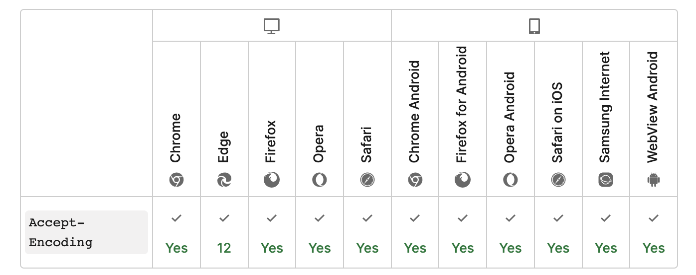
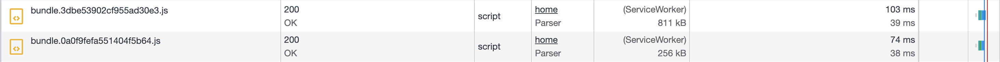
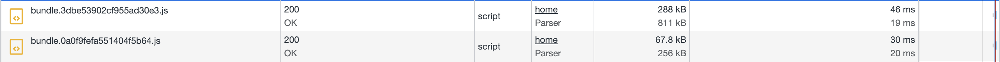

import { MDXImageWrapper } from 'components';

# 들어가며

리소스를 압축하면 사용자에게 더 적은 비용으로 리소스를 제공할 수 있다. 이번 게시글에서는 리소스를 압축해서 브라우저에게 전달하는 방법에 대해 정리하려 한다.

<br/>

# 브라우저는 압축된 파일을 해제할 수 있는가?

> All modern browsers can handle a gzip encoded response.
> 

<br/>

위는 관련된 스택오버플로우 글에서 발췌한 내용이다. 모던 브라우저는 gzip으로 압축된 파일을 인코딩할 수 있다고 한다. 실제로 리소스의 인코딩과 관련해서 요청 측에서 사용하는 Header 속성인 `Accept-Encoding`의 브라우저 호환성을 확인하면 브라우저의 대부분의 버전에서 지원하는 것을 확인할 수 있다. 이를 통해 브라우저에서 리소스의 압축을 해제하는 기능은 대부분의 브라우저에서 이용할 수 있다고 추측할 수 있다.

<MDXImageWrapper style={{ maxWidth: "100%" }} caption="Accept-Encoding 속성 지원 현황">
  
</MDXImageWrapper>

<br/>

추가로 응답받은 리소스의 압축 여부는 응답 헤더의 `Content-Encoding` 속성을 통해 확인 할 수 있다.

<br/>

# 파일 압축하기

대표적으로 리소스 파일을 압축할 때 아래의 두 가지 방법을 이용한다.

1. webpack 플러그인을 통해 빌드할 때 압축 진행
2. nginx에서 리소스 압축 진행 with gzip

<br/>

## 1. webpack 플러그인을 통해 빌드할 때 압축 진행

[CompressionWebpackPlugin](https://webpack.js.org/plugins/compression-webpack-plugin/)을 통해 빌드 시 압축을 진행할 수 있다. 압축을 기본적으로 gzip 방식으로 진행한다. 압축 방식을 변경하고 싶다면 [algorithm 옵션](https://webpack.js.org/plugins/compression-webpack-plugin/#algorithm)을 사용하면 된다.

<br/>

## 2. nginx에서 리소스 압축 진행 with gzip

nginx에서 gzip 압축 옵션은 다음과 같다.

<br/>

**gzip 옵션**

- `gzip [on/orr]`: gzip의 설정을 on/off하는 명령어입니다.
- `gzip_disable [regex]`: 해당 명령어 다음에 오는 문장이 요청 헤더에 User-Agent와 일치하면 gzip을 하지 않습니다.
- `gzip_vary [on/off]`: gzip, gzip_static, or gunzip의 설정들이 on으로 되어있을 때 응답 헤더에 “Vary: Accept-Encoding”를 넣을지 말지에 대한 명령어 입니다.
- `gzip_proxied`: 요청과 응답에 따라서 프록시된 요청에 대해서 gzipping을 할지 말지에 대한 설정입니다. “any”로 설정하면 모든 응답에 대해서 gzipping을 수행합니다.
- `gzip_comp_level [level]`: 응답에 대한 압축의 정도를 의미하며 level의 값은 1부터 9까지 가능합니다.
- `gzip_buffers [num] [size]`: num은 버퍼의 갯수를 의미하며 size는 그 버퍼의 크기를 의미합니다.
- `gzip_http_version [versino]`: minimum HTTP 통신의 버전을 정합니다.
- `gzip_types [types in array]`: “text/html”을 제외하고 MIME 타입에서 또 어떠한 응답 형태들을 gzipping 할지 정할 수 있습니다.
    
<br/>    

gzip 옵션 설정은 nginx의 기본 설정파일에서 할 수 있다. 파일의 경로 예시는 다음과 같다.

```jsx
/etc/nginx/nginx.conf
```

<br/>

해당 파일에서 gzip 옵션을 적용한 예시는 아래와 같다.

```jsx
{
	...
	gzip on;
	gzip_disable 'msie6';
	gzip_vary: on;
  gzip_types text/plain text/css application/json application/javascript text/xml application/xml application/xml+res text/javascript;
}
```

<br/>

💡Brotli 방식으로 압축하는 방법은 [해당 문서](https://docs.nginx.com/nginx/admin-guide/dynamic-modules/brotli/)에 명시돼 있다.

<br/>

### **참고 자료**

[Compression and Decompression](https://docs.nginx.com/nginx/admin-guide/web-server/compression/)

[[Nginx] Compressed Response with gzip](https://minholee93.tistory.com/entry/Nginx-Compressed-Response-with-gzip)

<br/>

# 어떤 방법을 사용할 것인가?

지금까지 파일을 압축하는 두 가지 방법을 알아봤다. 현재 프로젝트에서는 Nginx로 파일을 압축하는 방식을 채택했다. 그 이유는 **유연하게 압축 방식을 제공하기 위해서**이다.

<br/>

웹팩으로 빌드 파일을 압축해서 서버에 제공한다면 브라우저의 압축 알고리즘 지원에 맞게 대응하지 못할 수 있다. 즉 해당 방법을 이용하면 사용자의 브라우저에서 요청을 보낼 때 **Accept-Encoding에 따라 제공하는 컨텐츠의 압축 방식을 변경할 수 없다.**

<br/>

반면 Nginx에서는 gzip 뿐만 아니라 brotli 방식으로도 컨텐츠를 압축해서 제공할 수 있다. 또한 두 개의 압축 방식을 둘 다 제공하는 서버에서는 요청 시 들어오는 Accept-Encoding 헤더의 값에 따라 적절히 정적 컨텐츠를 압축해서 제공할 수 있다. 

<br/>

## Gzip과 Brotli 방식을 둘 다 지원해야하는 이유

brotli 압축 알고리즘의 경우 gzip에 의해 압축 성능이 좋다고 알려져 있다. (참고: [더 나은 압축 알고리즘, Brotli](https://yceffort.kr/2021/01/brotli-better-html-compression))

따라서 웹 성능 최적화 측면에서 brotli 알고리즘을 사용하는 것이 적절해 보인다.

하지만, gzip의 경우 대부분의 브라우저에서 지원하는 반면에 brotli의 경우 IE에서 지원하지 않는다. 

때문에 구형 브라우저에 대응하기 위해서는 gzip 압축 알고리즘 또한 지원해야한다.

<br/>

gzip 지원 현황

<MDXImageWrapper caption="gzip 지원 현황">
  
</MDXImageWrapper>

<br/>

brotli 지원 현황

<MDXImageWrapper caption="brotli 지원 현황">
  
</MDXImageWrapper>

<br/>

💡 만약 요청을 한 브라우저가 brotli와 gzip을 모두 지원한다면, nginx는 압축 알고리즘으로 brotli을 우선적으로 고려한다고 알려져있다.(참고: [Enable both brotli and gzip on NGINX?](https://serverfault.com/a/941778))

<br/>

## 결론

웹 서버로 들어온 **요청의 Accept-Encoding 헤더에 따라 컨텐츠를 압축해서 제공하기 위해 Nginx를 통한 컨텐츠 압축 방법을 채택했다.**

<br/>

## 참고 자료

[Enable both brotli and gzip on NGINX?](https://serverfault.com/a/941778)

[](https://computingforgeeks.com/how-to-enable-gzip-brotli-compression-for-nginx-on-linux/)

<br/>

# 끝으로

실제로 프로젝트에서 **nginx에서 리소스 압축 진행 with gzip** 방식으로 리소스 압축을 진행했다. 

그 결과 네트워크 요청 시 811kb였던 파일을 288kb까지 압축해서 응답받을 수 있었다.

<br/>

**압축 전**

<MDXImageWrapper style={{ maxWidth: "100%" }} caption="압축 전 네트워크 요청 크기">
  
</MDXImageWrapper>

<br/>

**압축 후**

<MDXImageWrapper style={{ maxWidth: "100%" }} caption="압축 후 네트워크 요청 크기">
  
</MDXImageWrapper>

<br/>

# 참고 자료

[Is GZIP Automatically Decompressed by Browser?](https://stackoverflow.com/questions/32172704/is-gzip-automatically-decompressed-by-browser)

[Accept-Encoding - HTTP | MDN](https://developer.mozilla.org/ko/docs/Web/HTTP/Headers/Accept-Encoding)

[Content-Encoding - HTTP | MDN](https://developer.mozilla.org/ko/docs/Web/HTTP/Headers/Content-Encoding)

[더 나은 압축 알고리즘, Brotli](https://yceffort.kr/2021/01/brotli-better-html-compression)